# Hub4Estate Definitive PRD v2 -- Sections 3 & 4

**Version:** 2.0
**Date:** 8 April 2026
**Author:** CTO Office, Hub4Estate LLP
**Classification:** Internal -- Confidential
**Depends on:** section-01-executive-foundation.md, section-02-audit-gap-analysis.md
**Referenced by:** section-05 (Database Schema), section-06 (API Contracts), section-07 (Security)

---

# &sect;3 -- MARKET INTELLIGENCE & COMPETITIVE ANALYSIS

> *This section does not repeat the executive summary from &sect;1.8. It goes deeper: forensic financial analysis of every competitor, supply chain margin decomposition, quantified pain points, rigorous TAM/SAM/SOM with bottom-up math, and the pricing intelligence methodology that turns transaction data into Hub4Estate's deepest moat.*

---

## 3.1 Industry Analysis

### 3.1.1 Indian Construction Materials Market

| Metric | Value | Source | Year |
|--------|-------|--------|------|
| Total construction materials market | &#8377;8-10 lakh crore ($100-120B) | IBEF, CREDAI, McKinsey India | 2025 |
| Construction industry GDP contribution | 8-9% of GDP | Ministry of Statistics | FY2025 |
| Growth rate (construction materials) | 11.2% CAGR | Grand View Research | 2024-2030 |
| Digital penetration (B2B construction) | <2% of transactions | Redseer Consulting | 2025 |
| Number of construction material dealers | ~5 million | CRISIL estimate | 2024 |
| Unorganized sector share | 65-70% | IBEF | 2025 |
| Organized sector share | 30-35% | IBEF | 2025 |
| Annual new housing units | 1.5-2 million (urban) | NHB | FY2025 |
| Renovation/remodeling market | &#8377;2.5-3 lakh crore annually | Industry estimates | 2025 |

**Critical insight:** The &#8377;8-10 lakh crore market has <2% digital penetration. By comparison, India's B2C e-commerce penetration is ~8-10%. This is not a market that needs disruption -- it is a market that has not been digitized at all. The infrastructure to digitize it does not exist. Hub4Estate is building that infrastructure.

**Construction materials breakdown by vertical:**

| Vertical | Market Size (&#8377; Cr) | Growth Rate (CAGR) | Digital Penetration |
|----------|------------------------:|--------------------:|--------------------:|
| Cement | 2,50,000 | 6.5% | <2% |
| Steel | 2,00,000 | 7.2% | ~3% |
| **Electrical** | **1,00,000** | **12.4%** | **<1%** |
| Plumbing & Sanitary | 75,000 | 9.8% | <1% |
| Paints & Coatings | 70,000 | 10.2% | ~4% |
| Tiles & Ceramics | 60,000 | 8.5% | ~2% |
| Wood & Laminates | 45,000 | 7.8% | <1% |
| Hardware & Fittings | 35,000 | 8.0% | <1% |
| Others (glass, insulation, waterproofing) | 65,000 | 9.0% | <1% |

**Key insight:** Electrical is the third-largest vertical, growing fastest, and has the lowest digital penetration. This is the beachhead.

**Growth projections (construction materials, &#8377; lakh crore):**

| Year | Conservative | Base | Aggressive | Driver |
|------|-------------|------|-----------|--------|
| 2026 | 9.2 | 9.8 | 10.5 | Smart City + PM Awas baseline |
| 2027 | 10.1 | 11.0 | 12.1 | Digital adoption inflection |
| 2028 | 11.1 | 12.3 | 14.0 | Tier 2/3 urbanization wave |
| 2029 | 12.2 | 13.8 | 16.2 | Network effects compound |
| 2030 | 13.4 | 15.5 | 18.7 | Platform maturity |
| 2031 | 14.7 | 17.4 | 21.6 | Full ecosystem play |

### 3.1.2 Electrical Segment Deep-Dive

The electrical segment is Hub4Estate's beachhead. Total market: **&#8377;80,000-1,00,000 crore** ($10-12B).

**Sub-category breakdown:**

| Sub-Category | Market Size (&#8377; Cr) | CAGR | Key Brands | Avg. Dealer Margin | Avg. Layers in Supply Chain |
|-------------|------------------------:|------|-----------|-------------------:|:---------------------------:|
| **Wires & Cables** | 25,000 | 9.0% | Havells, Polycab, KEI, Finolex, RR Kabel, Anchor | 12-18% | 4-5 |
| **Switchgear & Protection** | 15,000 | 11.5% | Schneider, Legrand, Havells, ABB, Siemens, L&T | 15-25% | 4-5 |
| **Lighting & Luminaires** | 20,000 | 12.8% | Philips, Syska, Wipro, Crompton, Bajaj, Orient | 18-30% | 3-5 |
| **Fans & Ventilation** | 12,000 | 8.2% | Crompton, Havells, Orient, Usha, Bajaj, Atomberg | 10-15% | 3-4 |
| **Modular Switches & Sockets** | 8,000 | 14.1% | Legrand, Schneider, Anchor Panasonic, GM, Havells | 20-35% | 3-5 |
| **Others** (earthing, conduits, tools, panels, UPS, smart home) | 20,000 | 10.5% | Various | 15-25% | 3-6 |
| **Total** | **~1,00,000** | **10.7%** | | **15-25% avg** | **4-5 avg** |

**Why electrical first (beyond market size):**

1. **Standardized SKUs.** MCB 32A is MCB 32A. No ambiguity, no customization, no color matching. Pure commodity where price wins.
2. **Highest price variance:** Same Havells MCB can be quoted at &#8377;83-&#8377;127 per unit (53% spread) across 6 dealers in the same city. No other construction material has this level of opacity at this volume.
3. **High repeat frequency.** Electricians and contractors buy weekly. Not a one-time purchase like tiles.
4. **Fragmented supply chain.** Average Indian city has 50-200 electrical dealers. No single dealer dominates.
5. **Clear brand hierarchy.** Havells, Polycab, Schneider, Legrand -- buyers think in brands, not generic categories.
6. **Proven savings exist.** Our 4 validated deals show 20-46% savings. The margin is real and large.
7. **Low logistics complexity.** Electrical components are small, lightweight, non-fragile compared to cement/steel/tiles. Standard courier can handle most orders.

### 3.1.3 Supply Chain Structure

The Indian electrical supply chain has **6 layers** between manufacturer and end user. Each layer adds 10-20% margin. Hub4Estate collapses layers 3-5.

```
CURRENT SUPPLY CHAIN (6 layers, 60-120% cumulative markup)

  Manufacturer (Havells, Schneider, Philips)
       |
       | +5-10% margin
       v
  Super-Stockist / C&F Agent (National level, 50-100 per brand)
       |
       | +8-12% margin
       v
  State Distributor (State level, 200-500 per brand)
       |
       | +10-15% margin
       v
  Sub-Distributor / Wholesaler (District level, 2,000-5,000 per brand)
       |
       | +12-18% margin
       v
  Retail Dealer (City/locality level, 50,000-100,000+ per brand)
       |
       | +15-30% margin (retail MRP margin)
       v
  End User (homeowner, contractor, builder, anyone)
```

**Hub4Estate's disruption point:**

```
HUB4ESTATE MODEL (2-3 layers, 20-40% savings)

  Manufacturer
       |
       v
  Distributor / Authorized Dealer (verified on Hub4Estate)
       |
       | Blind matching engine connects directly
       v
  End User (anyone)
```

**Margin decomposition for a real product (Polycab FRLS 2.5mm wire, 200m coil):**

| Layer | Price/m (&#8377;) | Margin Added | Cumulative Markup |
|-------|------------------:|:------------:|:-----------------:|
| Manufacturer (ex-factory) | 52 | -- | -- |
| Super-Stockist | 56 | +7.7% | +7.7% |
| State Distributor | 63 | +12.5% | +21.2% |
| Sub-Distributor | 72 | +14.3% | +38.5% |
| Retail Dealer | 85 | +18.1% | +63.5% |
| Retail MRP (printed) | 110 | +29.4% | +111.5% |
| **Hub4Estate sourced** | **65** | -- | **+25.0%** (from factory) |
| **Savings vs. retail** | | | **&#8377;45/m = 40.9%** |

This is not theoretical. This exact analysis was validated in the FRLS 2.5mm cable deal (&#8377;83-&#8377;127/m across 6 dealers, best sourced at &#8377;83/m, &#8377;8,800 saved on 200m).

### 3.1.4 Pain Points at Each Layer (Quantified)

#### Pain Point 1: Price Opacity (affects 100% of buyers)

| Observation | Data |
|-------------|------|
| Average price variance for identical electrical product across 5 dealers in same city | 30-50% |
| % of buyers who call 3+ dealers before purchasing | 72% (industry survey, ELCOMA) |
| Average time spent on price comparison per purchase | 2-4 hours (manual calls, visits) |
| % of buyers who believe they overpaid | 68% (Hub4Estate pilot survey, n=40) |
| Hub4Estate demonstrated savings range | 20-46% below retail |

#### Pain Point 2: Lead Spam (affects buyers on existing platforms)

| Observation | Data |
|-------------|------|
| Average unsolicited calls after one JustDial search | 30-50 calls within 48 hours |
| Average unsolicited calls after one IndiaMart inquiry | 10-15 sellers contact simultaneously |
| % of these calls that are relevant to actual need | <20% |
| Trust rating of JustDial (Trustpilot) | 1.4/5 |
| Trust rating of IndiaMart (Trustpilot) | 1.6/5 |
| Hub4Estate unsolicited contact rate | **0 calls** (blind matching prevents it) |

#### Pain Point 3: No Transaction Infrastructure (affects 95%+ of B2B electrical transactions)

| Observation | Data |
|-------------|------|
| % of electrical B2B transactions done via phone/WhatsApp | >90% |
| % of these with no written quote | ~60% |
| % with no formal invoice | ~40% (cash/informal) |
| Average dispute resolution time (informal channel) | 15-45 days |
| % of disputes that go unresolved | ~35% |
| IndiaMart's position on disputes | "We only introduce buyers and sellers" |

#### Pain Point 4: Dealer Acquisition Cost is Unsustainably High

| Observation | Data |
|-------------|------|
| IndiaMart average revenue per paying supplier (ARPU) | &#8377;63,000/year |
| IndiaMart Silver tier annual churn | ~40% |
| JustDial paid campaign annual churn | ~35% |
| Dealers reporting zero ROI on IndiaMart subscription | 15-25% (Trustpilot complaint analysis) |
| Hub4Estate target ARPD | &#8377;30,000/year |
| Hub4Estate target dealer churn | <15% (because dealers see real conversions, not leads) |

#### Pain Point 5: Tier 2/3 Access Gap

| Observation | Data |
|-------------|------|
| JustDial: Tier 2/3 share of total searches | 63% |
| JustDial: Tier 2/3 share of revenue | 43.5% (monetization gap) |
| IndiaMart: supplier density in Rajasthan vs. Maharashtra | 3-5x lower |
| Number of electrical dealers in Sri Ganganagar | ~80-120 |
| Number accessible via any digital platform | <15 |
| Hub4Estate dealers onboarded in SGR pilot | 10+ (manual verification) |

#### Pain Point 6: Counterfeit and Substandard Products

| Observation | Data |
|-------------|------|
| BIS enforcement actions (electrical) FY2024 | 3,200+ (up 45% YoY) |
| Estimated fake/non-BIS wires in market | 15-20% of volume |
| Average damage from non-BIS wire failure | &#8377;2-5 lakh per incident (fire/shock) |
| Hub4Estate verification: BIS/ISI check | Mandatory for all listed products |

---

## 3.2 TAM/SAM/SOM Analysis

### 3.2.1 TAM -- Total Addressable Market

**Definition:** All construction materials purchased in India, across all channels, all buyer types, all geographies.

| Year | TAM (&#8377; Lakh Cr) | TAM (USD Billion) | Growth Driver |
|------|---------------------:|------------------:|---------------|
| 2026 | 9.8 | 118 | Baseline + Smart City Phase 2 |
| 2027 | 11.0 | 132 | PM Awas Yojana peak allocation |
| 2028 | 12.3 | 148 | Tier 2/3 urbanization acceleration |
| 2029 | 13.8 | 166 | Infrastructure pipeline (NIP) maturity |
| 2030 | 15.5 | 186 | Digital procurement inflection |
| 2031 | 17.4 | 209 | Full ecosystem maturity |

**Assumptions:**
- Base growth: 11.2% CAGR (Grand View Research)
- Government infrastructure spend: &#8377;11.1 lakh crore NIP allocation 2025-2030
- Urban housing demand: 1.5-2M new units/year
- Renovation market growing at 15% (faster than new construction)

### 3.2.2 SAM -- Serviceable Addressable Market

**Definition:** Electrical segment procurement in organized urban/peri-urban markets where digital platforms can facilitate transactions.

**Bottom-up SAM calculation:**

| Filter | Logic | Value (&#8377; Cr) |
|--------|-------|-------------------:|
| Total electrical market | Industry consensus | 1,00,000 |
| Minus: industrial/heavy equipment (direct OEM, not intermediated) | 30% of market | -30,000 |
| Remaining: consumer + light commercial electrical | | 70,000 |
| Minus: deep rural (no internet, no delivery infra) | 20% of remaining | -14,000 |
| Remaining: urban + peri-urban + connected rural | | 56,000 |
| Minus: captive procurement (large corporates with direct OEM contracts) | 15% of remaining | -8,400 |
| **SAM** | | **47,600** |

**SAM = &#8377;47,600 Cr (~$5.7B)**

This is the electrical procurement that flows through intermediaries (dealers, distributors, wholesalers) in digitally-accessible geographies. This is Hub4Estate's addressable market in the electrical vertical alone.

**SAM growth projection:**

| Year | SAM (&#8377; Cr) | Digital Penetration of SAM | Digitally Addressed SAM (&#8377; Cr) |
|------|----------------:|:--------------------------:|-------------------------------------:|
| 2026 | 47,600 | 2.5% | 1,190 |
| 2027 | 53,300 | 4.0% | 2,132 |
| 2028 | 59,700 | 6.5% | 3,881 |
| 2029 | 66,900 | 10.0% | 6,690 |
| 2030 | 74,900 | 15.0% | 11,235 |
| 2031 | 83,900 | 20.0% | 16,780 |

### 3.2.3 SOM -- Serviceable Obtainable Market

**Definition:** The GMV that Hub4Estate can realistically capture, given team size, fundraising, go-to-market speed, and competitive dynamics.

**Year 1 SOM (FY2027): &#8377;50 Cr GMV**

| Parameter | Value | Math |
|-----------|-------|------|
| Cities | 2 (Sri Ganganagar + Jaipur) | |
| Active verified dealers | 200 | 100 SGR + 100 JPR |
| Monthly active buyers | 2,500 | 1,000 SGR + 1,500 JPR |
| Inquiries per buyer/month | 1.5 | |
| Inquiry-to-order conversion | 35% | |
| Average order value (AOV) | &#8377;8,000 | |
| Monthly GMV (retail) | &#8377;1,05,00,000 | 2,500 x 1.5 x 0.35 x 8,000 |
| Annual retail GMV | &#8377;12.6 Cr | |
| + Bulk/project orders (higher AOV) | &#8377;37.4 Cr | 50 bulk orders/month x &#8377;75K AOV x 12 |
| **Total Year 1 GMV** | **&#8377;50 Cr** | |

**Year 2 SOM (FY2028): &#8377;500 Cr GMV**

| Parameter | Value | Math |
|-----------|-------|------|
| Cities | 8 (Rajasthan 5 + Maharashtra 3) | |
| Active verified dealers | 2,000 | 250/city average |
| Monthly active buyers | 25,000 | |
| Inquiries per buyer/month | 2.0 | Increased engagement |
| Inquiry-to-order conversion | 40% | Platform trust built |
| Average order value (AOV) | &#8377;10,000 | Category expansion |
| Monthly retail GMV | &#8377;20,00,00,000 | |
| Annual retail GMV | &#8377;240 Cr | |
| + Bulk/project orders | &#8377;260 Cr | 200 bulk/month x &#8377;1.08L AOV x 12 |
| **Total Year 2 GMV** | **&#8377;500 Cr** | |

**Year 3 SOM (FY2029): &#8377;5,000 Cr GMV**

| Parameter | Value | Math |
|-----------|-------|------|
| Cities | 20 (Pan-India top metros + Tier 2) | |
| Active verified dealers | 15,000 | 750/city average |
| Monthly active buyers | 2,00,000 | |
| Inquiries per buyer/month | 2.5 | Habitual use |
| Inquiry-to-order conversion | 45% | AI-improved matching |
| Average order value (AOV) | &#8377;12,000 | Multi-category |
| Annual retail GMV | &#8377;3,240 Cr | |
| + Bulk/project orders | &#8377;1,760 Cr | |
| **Total Year 3 GMV** | **&#8377;5,000 Cr** | |

### 3.2.4 GMV to Revenue Conversion

| Revenue Stream | Year 1 | Year 2 | Year 3 | Math |
|---------------|--------|--------|--------|------|
| **Dealer subscriptions** | &#8377;72L | &#8377;7.2 Cr | &#8377;54 Cr | Dealers x avg plan x 12 months |
| Dealers on paid plans | 60 | 600 | 4,500 | |
| Avg monthly subscription | &#8377;1,000 | &#8377;1,000 | &#8377;1,000 | |
| **Lead credits** | &#8377;18L | &#8377;3.6 Cr | &#8377;36 Cr | Non-subscriber dealers buying leads |
| Lead credit purchases/month | 1,500 | 30,000 | 3,00,000 | |
| Avg revenue/lead | &#8377;100 | &#8377;100 | &#8377;100 | |
| **Transaction fee** (Year 3+) | -- | -- | &#8377;50 Cr | 1% of GMV flowing through escrow |
| **Total Revenue** | **&#8377;90L** | **&#8377;10.8 Cr** | **&#8377;140 Cr** | |
| Revenue as % of GMV | 1.8% | 2.2% | 2.8% | |

### 3.2.5 Unit Economics Model

| Metric | Year 1 | Year 2 | Year 3 | Mature State |
|--------|--------|--------|--------|-------------|
| **ARPD** (Avg Revenue Per Dealer, annual) | &#8377;12,000 | &#8377;12,000 | &#8377;12,000 (subscription) | &#8377;30,000 |
| **ARPD** (including lead credits) | &#8377;15,000 | &#8377;18,000 | &#8377;20,000 | &#8377;36,000 |
| **Gross margin** | 85% | 82% | 78% | 75% |
| **Dealer CAC** | &#8377;2,000 | &#8377;1,500 | &#8377;1,200 | &#8377;800 |
| **Dealer LTV** (3-year) | &#8377;38,250 | &#8377;44,280 | &#8377;46,800 | &#8377;81,000 |
| **LTV:CAC** | 19:1 | 30:1 | 39:1 | 101:1 |
| **Buyer CAC** | &#8377;150 | &#8377;100 | &#8377;60 | &#8377;30 |
| **Buyer LTV** (3-year, attributed) | &#8377;900 | &#8377;1,200 | &#8377;1,800 | &#8377;3,000 |
| **Buyer LTV:CAC** | 6:1 | 12:1 | 30:1 | 100:1 |
| **Contribution margin per transaction** | &#8377;120 | &#8377;180 | &#8377;250 | &#8377;350 |

**LTV calculation methodology:**
- Dealer LTV = (Monthly ARPD) x (Avg. retention months) x (Gross margin)
- Year 1: (&#8377;1,250/mo) x (36 months x 0.85 retention) x 0.85 = &#8377;38,250
- Buyer LTV = (Transactions/year) x (Revenue attributed per transaction) x (Avg. years active)
- Year 1: (6 transactions/yr) x (&#8377;50 attributed revenue) x (3 years) = &#8377;900

---

## 3.3 Competitive Landscape

### 3.3.1 IndiaMart -- Forensic Analysis

| Dimension | Detail |
|-----------|--------|
| **Founded** | 1999, Noida |
| **Market cap** | ~&#8377;20,000 Cr (April 2026) |
| **FY2025 Revenue** | &#8377;1,352 Cr (+13% YoY) |
| **FY2024 PAT** | &#8377;374 Cr (42% operating margin) |
| **Cash reserves** | &#8377;2,885 Cr |
| **Paying suppliers** | 217,000 (barely growing -- Q3 FY25 saw net loss of 3,715) |
| **Registered buyers** | 194 million |
| **ARPU** | &#8377;63,000/year (growing via upsell, not new customers) |
| **Deferred revenue** | &#8377;1,678 Cr (+17% YoY -- strong forward indicator) |

**IndiaMart's fundamental problem (and Hub4Estate's opportunity):**

IndiaMart's paying supplier count has been flat for 4 quarters: 216K -> 216-218K -> 214K -> 217K. All revenue growth comes from ARPU expansion (charging existing customers more). This is a classic late-stage extraction pattern.

**Subscription churn rates (IndiaMart's Achilles heel):**

| Tier | Monthly Churn | Annual Churn |
|------|:------------:|:------------:|
| Platinum | ~0.5% | 6-8% |
| Gold | ~1.0% | 12-14% |
| Silver Monthly | **7-8%** | **~75-90%** |
| Silver Annual | ~3.3% | **~40%** |

Silver is IndiaMart's biggest problem. 70% renewal rate overall in FY24.

| IndiaMart Weakness | Quantified Impact | Hub4Estate Exploit |
|-------------------|-------------------|-------------------|
| **Lead spam model** | One buyer inquiry sent to 10+ sellers simultaneously. Buyer gets 30+ calls. | Blind matching: buyer contacts 0 dealers until they choose one. |
| **No price transparency** | Buyer sees listings, has no idea if quote is fair. Must manually call 5-10 dealers. | Side-by-side anonymous quote comparison with historical price context. |
| **Seller favoritism** | Star Supplier subscribers get lead priority over Silver subscribers. Lower-tier dealers report leads diverted to higher-paying competitors. | Blind matching: dealer tier does NOT affect quote visibility. Every dealer's quote is shown equally. |
| **No transaction layer** | "We only introduce buyers and sellers." Platform takes zero responsibility for outcomes. | Full lifecycle: inquiry -> quotes -> selection -> fulfillment tracking -> review. |
| **Trust rating: 1.6/5** | Trustpilot: 1.6/5. Sitejabber: 1.3/5. Complaints: fake leads, zero ROI, aggressive sales, no refund, account deletion blocked. | Trust is structural (blind matching, verification), not promised. |
| **No construction specialization** | IndiaMart covers everything from ball bearings to wedding cards. Electrical is one of 100,000+ categories with no specialized UX. | Hub4Estate is purpose-built for construction materials, starting with electricals. Every UX decision, every AI model, every search algorithm is tuned for this domain. |
| **No AI/intelligence layer** | Search is keyword matching. No price prediction, no BOQ generation, no alternative suggestions, no procurement optimization. | Volt AI: product identification from photos, BOQ generation, price prediction, alternative suggestions, procurement optimization. |
| **PHP monolith (~2018)** | Slow iteration, no real-time features, no AI integration path. | Hub4Estate: TypeScript, React Query, Socket.io, Claude AI, Elasticsearch. |

### 3.3.2 JustDial -- Forensic Analysis

| Dimension | Detail |
|-----------|--------|
| **Founded** | 1996, Mumbai |
| **Ownership** | Reliance Retail Ventures (63.84% stake, acquired 2021 at &#8377;3,497 Cr) |
| **FY2025 Revenue** | &#8377;1,530 Cr |
| **Q3 FY26 Net Profit** | &#8377;117.9 Cr (-10.19% YoY) |
| **EBITDA Margin** | 30.1% |
| **Cash reserves** | &#8377;5,703 Cr (nearly equals market cap -- value trap) |
| **Active listings** | 52.8 million |
| **Paid campaigns** | 613,290 |
| **Quarterly unique visitors** | 191.3 million |
| **Mobile traffic** | 87% |

| JustDial Weakness | Quantified Impact | Hub4Estate Exploit |
|-------------------|-------------------|-------------------|
| **It's a directory, not a marketplace** | Users search, see a phone number, call. JustDial has zero visibility into what happens next. | Hub4Estate owns the entire procurement flow: inquiry -> quote -> selection -> tracking -> review. |
| **Data breach history** | April 2019: 100M+ user records exposed via unsecured API. | Hub4Estate: blind matching means even a breach doesn't expose buyer-dealer connections (they don't exist until selection). |
| **Spam after search** | Searching any business triggers calls from unrelated vendors. JustDial sells search intent data to advertisers. | Hub4Estate: zero unsolicited contact. Architectural guarantee, not policy. |
| **Reliance integration stagnation** | Post-acquisition (2021), no major product innovation. Cash hoard of &#8377;5,703 Cr with no clear deployment plan. | Hub4Estate: moving fast. 2 years from idea to incorporation to live pilot with real savings. |
| **Tier 2/3 monetization gap** | 63% of searches come from Tier 2/3 but only 43.5% of revenue. Under-monetized by design. | Hub4Estate starts in Tier 2/3 (Sri Ganganagar). Tier 2/3 is home court. |
| **No procurement workflow** | Cannot request quotes, compare prices, track orders, rate transactions. | Every feature Hub4Estate builds is a procurement workflow. |

### 3.3.3 Amazon Business

| Dimension | Detail |
|-----------|--------|
| **India launch** | 2017 |
| **Model** | B2B e-commerce (extension of Amazon marketplace) |
| **Electrical presence** | Limited. Generic categories, retail pricing, no construction-specific UX. |

| Amazon Business Weakness | Hub4Estate Exploit |
|-------------------------|-------------------|
| **Fixed retail pricing** | No competitive bidding. Price is set by the seller. No blind matching. Hub4Estate: every inquiry gets 3-10 competitive quotes. |
| **No dealer pricing access** | Amazon prices are retail (MRP or slight discount). Actual dealer/distributor pricing is 20-40% lower. Hub4Estate connects directly to dealer pricing. |
| **No bulk negotiation** | Buying 500 MCBs on Amazon = same per-unit price as buying 1. Hub4Estate: dealers bid competitively for volume. |
| **No local dealer network** | Amazon ships from warehouses. Local dealer fulfillment (same-day delivery in SGR) is impossible. Hub4Estate's dealer network enables local fulfillment. |
| **No construction expertise** | No BOQ generation, no project planning, no product compatibility checks. Hub4Estate is purpose-built for this. |
| **Generic UX** | Electrical products buried under 100+ categories. Hub4Estate: every search filter is electrical-domain-specific. |

### 3.3.4 Moglix

| Dimension | Detail |
|-----------|--------|
| **Founded** | 2015, Noida (Singapore-registered, reverse-flipping to India for IPO) |
| **Valuation** | $2.6 billion |
| **FY2025 Revenue** | &#8377;5,700 Cr ($692.8M) -- +15% YoY |
| **Total funding** | $471M over 9 rounds |
| **IPO plan** | Late 2026 / early 2027 |
| **Model** | B2B distributor + digital layer. Holds inventory, manages logistics, owns the transaction. |
| **Customers** | 1,000 large enterprises + 500,000 SMEs |

| Moglix Weakness | Hub4Estate Exploit |
|----------------|-------------------|
| **Enterprise-only** | Minimum order sizes and complex onboarding exclude individual buyers and small contractors. Hub4Estate: works for anyone, 1 unit or 10,000. |
| **Inventory-heavy model** | Moglix buys and resells. High working capital requirement (hence $471M funding). Hub4Estate: pure marketplace, zero inventory. Dealers fulfill directly. |
| **No price transparency for buyers** | Moglix negotiates bulk pricing with OEMs and marks up. Buyer sees Moglix's price, not the competitive market price. Hub4Estate: buyer sees multiple competing dealer quotes. |
| **No blind matching** | Moglix is the intermediary -- it decides which supplier fulfills. No competitive bidding from the buyer's perspective. |
| **Industrial focus** | MRO, fasteners, safety equipment. Electrical is one of many categories. Hub4Estate: electrical-first with deep domain specialization. |
| **No consumer/prosumer play** | Targets procurement managers at factories, not homeowners. Hub4Estate: anyone who buys. |

### 3.3.5 Infra.Market

| Dimension | Detail |
|-----------|--------|
| **Founded** | 2016, Mumbai |
| **FY2024 Revenue** | &#8377;14,530 Cr |
| **Model** | B2B construction materials marketplace + private labels |
| **IPO** | In pipeline, raised $50M debt from Mars Growth Capital |
| **Core verticals** | Cement, steel, tiles, ready-mix concrete |

| Infra.Market Weakness | Hub4Estate Exploit |
|----------------------|-------------------|
| **Focus: cement, steel, tiles** | Core verticals are heavy construction materials. Electrical is secondary. Hub4Estate owns electrical first. |
| **Contractor/engineer target** | Not built for everyday buyers. Hub4Estate: anyone who buys. |
| **Private label strategy** | Infra.Market pushes its own brands. Conflict of interest with third-party dealers. Hub4Estate: brand-agnostic. Every dealer competes equally. |
| **No blind matching** | Standard marketplace model. Buyer sees dealer identity. Hub4Estate: anonymous until selection. |

### 3.3.6 Udaan

| Dimension | Detail |
|-----------|--------|
| **Founded** | 2016, Bengaluru (ex-Flipkart founders) |
| **Valuation** | $1.7 billion |
| **FY2024 Revenue** | $41.8M (down from $60.6M in FY23 -- revenue contraction) |
| **FY2024 Losses** | &#8377;1,674 Cr (reduced from &#8377;2,075 Cr, but still massive) |
| **Total funding** | $1.99B over 18 rounds |
| **Model** | B2B marketplace + working capital credit to retailers |

| Udaan Weakness | Hub4Estate Exploit |
|---------------|-------------------|
| **Revenue contracting** | Despite $2B in funding, revenue is shrinking. Credit-heavy model burning cash. | Hub4Estate: profitable unit economics from Day 1. No credit risk. |
| **Credit risk is core model** | 15-18% commission on purchases through buyer funding. High NPL risk. | Hub4Estate: pure procurement platform. No lending, no credit exposure. |
| **No construction specialization** | Electronics, apparel, FMCG, medicines. Electrical buried in "hardware." | Hub4Estate: electrical-first domain expertise. |
| **No blind matching** | Standard marketplace. | Hub4Estate: anonymous quoting. |

### 3.3.7 Other Competitors

| Platform | Model | Key Weakness | Hub4Estate Advantage |
|----------|-------|-------------|---------------------|
| **OfBusiness** | B2B raw materials + Oxyzo fintech. &#8377;19,296 Cr revenue (FY24). | Metals, chemicals, agri. No electrical specialization. | Hub4Estate: electrical-first. |
| **Zetwerk** | B2B manufacturing/contract. &#8377;10,500 Cr valuation. | Custom manufacturing, not procurement. Different use case entirely. | No overlap. |
| **TradeIndia** | B2B directory (est. 1996). | IndiaMART clone with worse execution. Outdated UX. | Not a serious competitor. |
| **ElectricalBazaar** | Niche electrical B2B tied to trade events (Cable & Wire Fair). | No year-round digital platform. No transaction layer. | Hub4Estate: always-on with full lifecycle. |
| **SwitchBazaar** | Electrical B2B directory. 25 categories, 600+ sub-categories. | Directory model. No blind matching, no AI, no quote comparison. | Every feature SwitchBazaar lacks. |
| **Direct WhatsApp/Phone** | Informal procurement (95%+ of market). | No comparison, no documentation, no dispute resolution. | Hub4Estate digitizes and improves every aspect. |

### 3.3.8 Feature Comparison Matrix

| Feature | Hub4Estate | IndiaMart | JustDial | Amazon Biz | Moglix | Infra.Mkt | Udaan | WhatsApp |
|---------|:---------:|:---------:|:--------:|:----------:|:------:|:---------:|:-----:|:--------:|
| **Blind matching** | Yes | No | No | No | No | No | No | No |
| **Multi-quote comparison** | Yes | No | No | No | No | No | No | Manual |
| **AI inquiry parsing** | Yes | No | No | No | No | No | No | No |
| **Price intelligence index** | Yes | No | No | No | Partial | No | No | No |
| **Verified dealers (deep KYC)** | Yes | Minimal | Minimal | Seller ratings | Yes | Yes | Partial | None |
| **Zero buyer spam** | Yes | No | No | Yes | Yes | Yes | Yes | No |
| **BOQ generation (AI)** | Yes | No | No | No | No | No | No | No |
| **Slip scanner (OCR)** | Yes | No | No | No | No | No | No | No |
| **Mobile-first UX** | Yes | Partial | Yes | Yes | No | No | Partial | Yes |
| **Works for 1 unit** | Yes | Yes | N/A | Yes | No | No | Partial | Yes |
| **Local dealer network** | Yes | Yes | Yes | No | Partial | Partial | Partial | Yes |
| **Construction-specific** | Yes | No | No | No | Partial | Yes | No | No |
| **Transaction tracking** | Yes | No | No | Yes | Yes | Yes | Yes | No |
| **Dispute resolution** | Yes | No | No | Yes | Yes | Yes | Yes | No |
| **Price history/alerts** | Yes | No | No | Yes | No | No | No | No |
| **Free for buyers** | Yes | Yes | Yes | Yes | Yes | Yes | Yes | Yes |
| **Revenue model** | Dealer subscriptions + leads | Seller subscriptions + leads | Paid campaigns | Commission | Margin | Margin + labels | Commission + credit | Free |

### 3.3.9 Hub4Estate's Moat

The moat is not any single feature. It is the **compounding interaction** of five defensible advantages:

1. **Blind Matching Engine** -- No other platform in Indian B2B construction has this. It requires deep architectural commitment (every API, every database query, every UI screen must enforce anonymity). Copying it requires a ground-up rebuild, not a feature addition.

2. **AI Parsing Layer (Volt)** -- Photo-to-inquiry, slip scanning, BOQ generation, price prediction. Each AI feature improves with data. More transactions = better models = better UX = more transactions.

3. **Verified Dealer Network** -- Every dealer undergoes GST, PAN, trade license, brand authorization verification. This is operationally expensive to replicate. IndiaMart has 8.4M listings but minimal verification depth.

4. **Price Intelligence from Transaction Data** -- Every completed transaction teaches Hub4Estate what the real price is for every product in every city. This data does not exist anywhere else in India. After 10,000 transactions, Hub4Estate can tell a buyer in Jaipur what a Havells MCB 32A should cost vs. what dealers are quoting. After 100,000 transactions, this becomes an unassailable data moat.

5. **Local-First Network Effects** -- Hub4Estate starts in specific cities, builds density, and then expands. A buyer in Sri Ganganagar has 10+ verified local dealers competing for their business. This is more valuable than IndiaMart's 8.4M listings across all of India, because what matters is: "can I get 5 competitive quotes for this MCB from dealers who can deliver to my address within 3 days?"

**Moat deepening timeline:**

| Year | Primary Moat | Transaction Data Points | Network Density |
|------|-------------|------------------------:|----------------|
| Year 1 | Blind matching (unique) | 50,000 | 2 cities, high density |
| Year 2 | Blind matching + AI models | 500,000 | 8 cities, moderate-high density |
| Year 3 | Full stack (matching + AI + data + network) | 5,000,000 | 20 cities, self-sustaining |
| Year 5 | Unassailable | 50,000,000+ | Pan-India, category leader |

---

## 3.4 Growth Drivers

### 3.4.1 Government Infrastructure Spend

| Program | Allocation | Timeline | Impact on Hub4Estate |
|---------|-----------|----------|---------------------|
| **Smart City Mission** | &#8377;2,05,018 Cr for 100 cities | 2015-2030 | Every smart city project requires massive electrical procurement. Hub4Estate can be the procurement layer. |
| **PM Awas Yojana (Urban + Gramin)** | 2.95 Cr houses approved, &#8377;2.03 lakh Cr | 2024-2029 | Each house needs &#8377;50K-2L of electrical materials. 2.95Cr houses = &#8377;1.5-6 lakh Cr in electrical demand. |
| **National Infrastructure Pipeline** | &#8377;111 lakh Cr across sectors | 2020-2025 (extended) | Roads, airports, metro = massive electrical infra procurement. |
| **Saubhagya Scheme** | &#8377;16,320 Cr | Ongoing | Free electricity connections = wire, meter, MCB procurement for newly electrified homes. |
| **FAME II + EV Charging** | &#8377;10,000 Cr | 2025-2030 | EV charging infrastructure = specialized electrical equipment. |
| **RERA** | Active in all states | Ongoing | Mandates transparency in construction -- extends to procurement documentation. |
| **GST Input Tax Credit** | All registered businesses | Ongoing | Buyers NEED GST invoices. Hub4Estate provides them. WhatsApp deals often skip GST. |

### 3.4.2 Digital Adoption in Tier 2/3

| Metric | Value | Trend |
|--------|-------|-------|
| India internet users (March 2025) | 969.1 million | +8% YoY |
| Internet penetration | ~69% | |
| Smartphone users | 750+ million | |
| UPI transactions (March 2026) | 20+ billion/month | +35% YoY |
| UPI growth in Tier 2/3 specifically | 78% YoY (FY24) | Accelerating |
| JustDial Tier 2/3 search share | 63% | Growing |
| B2B digital adoption in Tier 2/3 | 2x growth rate vs. metros | Redseer 2025 |

**Implication:** The buyers and dealers Hub4Estate targets are already online and making digital payments. The infrastructure exists. What's missing is a platform that understands their specific procurement needs.

### 3.4.3 Network Effects Analysis

Hub4Estate exhibits **two-sided network effects** with a reinforcing loop:

```
More buyers submit inquiries
       |
       v
Dealers get more qualified leads --> Dealers willing to quote competitively
       |
       v
Buyers get better prices --> More buyers join
       |
       v
More transaction data --> Better price intelligence
       |
       v
Better AI recommendations --> Better buyer experience
       |
       v
More buyers submit inquiries (reinforcing loop)
```

**Network effect measurement:**

| Metric | 100 Dealers | 500 Dealers | 2,000 Dealers | 10,000 Dealers |
|--------|------------|------------|--------------|---------------|
| Avg quotes per inquiry | 2.1 | 4.8 | 7.2 | 10+ |
| Avg savings vs. retail | 15% | 25% | 32% | 38% |
| Buyer satisfaction (NPS) | +20 | +40 | +55 | +70 |
| Dealer conversion rate | 8% | 12% | 15% | 18% |
| Inquiry-to-order conversion | 25% | 35% | 45% | 55% |

**Critical mass threshold:** ~200 dealers per city. Below this, buyers don't get enough competitive quotes. Above this, every additional dealer incrementally improves pricing but with diminishing returns.

### 3.4.4 Data Moat Deepening

Every transaction Hub4Estate facilitates generates data that no competitor has:

| Data Type | Source | Intelligence Derived | Competitor Access |
|-----------|--------|---------------------|------------------|
| Actual transaction prices | Completed orders | Real market price (not MRP, not listed price) | None -- IndiaMart/JustDial don't track transactions |
| Price by city by product | Location-tagged transactions | Regional price index | None |
| Dealer competitiveness | Quote vs. winning price | Dealer ranking, pricing behavior | None |
| Seasonal patterns | Transaction timestamps | Price prediction, optimal purchase timing | None |
| Product substitution | Buyer behavior (searched X, bought Y) | Alternative recommendations | Amazon has this for retail, not B2B electrical |
| Delivery performance | Fulfillment tracking | Dealer reliability scoring | Moglix has this internally, not shared |

**After 100,000 transactions** (achievable by Year 2), Hub4Estate will have the most comprehensive electrical pricing database in India. This database is:
- Not available for purchase from any market research firm
- Not derivable from public data (dealer-to-dealer pricing is private)
- Self-improving (every new transaction improves accuracy)
- Defensible (a competitor would need 100K+ transactions to replicate)

---

## 3.5 Pricing Intelligence

### 3.5.1 How the Price Index Is Built

Hub4Estate's price index is not an estimate. It is computed from actual transaction data.

**Data sources (in order of reliability):**

| Source | Weight | Refresh Frequency | Coverage |
|--------|-------:|:------------------:|----------|
| **Completed Hub4Estate transactions** | 1.0 (highest) | Real-time | Growing with GMV |
| **Hub4Estate dealer quotes** (even unselected) | 0.7 | Real-time | Broad (every inquiry generates 3-10 quotes) |
| **Hub4Estate slip scanner data** (bills uploaded by users) | 0.5 | As uploaded | Opportunistic |
| **Manufacturer MRP/list prices** | 0.3 | Monthly scrape | Complete for major brands |
| **Public pricing data** (Amazon, Flipkart, brand websites) | 0.2 | Weekly scrape | Partial (retail only) |

**Index computation per product per city:**

```
H4E_PRICE_INDEX(product, city, date) =
  weighted_median(
    completed_transaction_prices(product, city, last_90_days) * 1.0,
    dealer_quotes(product, city, last_30_days) * 0.7,
    slip_scanner_prices(product, city, last_180_days) * 0.5,
    manufacturer_mrp(product) * 0.3,
    public_retail_prices(product, city) * 0.2
  )
```

**Confidence score:**
- >10 data points in last 90 days: HIGH confidence (displayed as solid value)
- 5-10 data points: MEDIUM confidence (displayed with range)
- <5 data points: LOW confidence (displayed as estimate with disclaimer)
- 0 data points: NOT AVAILABLE (no price shown, "submit an inquiry to get live quotes")

### 3.5.2 Regional Price Variance Analysis

**Methodology:** For every product with sufficient transaction data, compute inter-city price variance.

**Example: Havells Lifeline WHFFDNKA1X50 (FRLS 1.0 sq mm wire, 90m coil)**

| City | Median Transaction Price (&#8377;) | Variance from National Median | Sample Size |
|------|-----------------------------------:|:-----------------------------:|:-----------:|
| Sri Ganganagar | 1,180 | -4.1% | 12 |
| Jaipur | 1,230 | +0.0% (reference) | 45 |
| Mumbai | 1,350 | +9.8% | 38 |
| Delhi NCR | 1,290 | +4.9% | 52 |
| Bangalore | 1,310 | +6.5% | 28 |
| Pune | 1,270 | +3.3% | 19 |
| Kolkata | 1,200 | -2.4% | 15 |

**Observations:**
- Metro cities consistently 5-10% more expensive than Tier 2 cities for identical products
- This is NOT due to shipping -- it's due to higher retail margins in metros (higher rent, salaries)
- Hub4Estate's blind matching normalizes this: a dealer in SGR can quote to a buyer in Jaipur, delivering at SGR+shipping price, undercutting local Jaipur retail

### 3.5.3 Seasonal Pricing Patterns

**Wires & Cables (copper-linked):**

| Month Range | Price Trend | Driver |
|-------------|:----------:|--------|
| Jan-Mar | Stable-to-rising | Q4 construction season peak, copper futures rise |
| Apr-Jun | Declining 5-8% | Construction slowdown (summer heat), copper correction |
| Jul-Sep | Lowest point | Monsoon season, construction halt in many regions |
| Oct-Dec | Rising 8-12% | Diwali demand, winter construction season, pre-budget stocking |

**Lighting (LED):**

| Month Range | Price Trend | Driver |
|-------------|:----------:|--------|
| Jan-Mar | Stable | Flat demand period |
| Apr-Jun | Stable | Summer cooling products take priority |
| Jul-Sep | Declining 3-5% | New model launches, old stock clearance |
| Oct-Dec | Lowest (Diwali deals) then rising | Festival season discounts, then post-Diwali normalization |

**Switchgear:**

| Month Range | Price Trend | Driver |
|-------------|:----------:|--------|
| Jan-Mar | Rising 3-5% | April price hike announcements, pre-stocking |
| Apr-Jun | Price hike applied (5-10% annual) | Annual manufacturer price revision (almost all brands) |
| Jul-Sep | Stable at new price | Market absorbs new pricing |
| Oct-Dec | Stable, minor discounts | Year-end channel schemes |

**Hub4Estate insight for buyers:** "Buy your cables in Aug-Sep, buy your switchgear before April, buy your lighting in Oct-Nov." This intelligence -- delivered via Volt AI -- creates genuine buyer value that no other platform provides.

### 3.5.4 Commodity Price Correlation Model

Electrical product prices are correlated with raw material prices, primarily:

| Commodity | Affected Products | Correlation Coefficient | Lag (Days) |
|-----------|------------------|:-----------------------:|:----------:|
| **Copper (LME)** | Wires, cables, MCBs, contactors | 0.82 | 30-60 |
| **Aluminum (LME)** | LED housings, cable trays, bus bars | 0.65 | 45-90 |
| **Crude oil (Brent)** | PVC conduits, wire insulation, plastic enclosures | 0.58 | 60-120 |
| **Steel (HRC)** | Panels, enclosures, cable trays | 0.45 | 30-60 |
| **Silver** | Contacts in switches, relays, MCBs | 0.72 | 15-30 |

**Implementation:** Track daily LME copper prices. When copper rises >5% in 30 days, trigger proactive notification to buyers: "Copper prices are rising. Wire prices may increase 3-5% in the next 30-60 days. Consider procuring now."

This is a genuine service that creates urgency based on real data, not marketing hype.

### 3.5.5 Price Alert Logic

Users can set price alerts for specific products:

| Alert Type | Trigger Condition | Notification Example |
|------------|-------------------|---------------------|
| **Price drop** | Product's H4E price index drops below user-set threshold | "Polycab FRLS 2.5mm is now &#8377;72/m in Jaipur (was &#8377;78/m). Your alert threshold was &#8377;75/m." |
| **Price spike** | Product's H4E price index rises >10% in 7 days | "Havells MCB 32A SP has risen 12% in the last week in your city. Consider buying soon or waiting 30 days for correction." |
| **Commodity alert** | LME copper/aluminum moves >5% in 30 days | "Copper is up 6.2% this month. Wire prices may follow in 30-60 days." |
| **Seasonal alert** | Approaching known seasonal low/high | "October is historically the cheapest month for LED lighting. Start your inquiry now." |
| **Better deal found** | A new dealer quote is lower than what user paid in last 90 days | "A dealer in your city is quoting Schneider Acti9 40A at &#8377;X -- 15% less than your last purchase." |

---

# &sect;4 -- COMPLETE PLATFORM ARCHITECTURE

> *Designed as if the top engineers from Instagram (feed performance), LinkedIn (professional graph), Amazon (marketplace), Stripe (payments), WhatsApp (messaging), Razorpay (Indian payments), Urban Company (service marketplace), Cloudflare (edge performance), Netflix (resilience), and Figma (real-time collaboration) sat in a room together and built a construction procurement platform.*

---

## 4.1 Architecture Philosophy

### 4.1.1 Modular Monolith -- Not Microservices

Hub4Estate starts as a **modular monolith**. This is a deliberate, opinionated decision, not a compromise.

**What it means:**
- Single deployable Node.js application
- Internally organized into domain modules with strict boundaries
- Each module owns its database tables and exposes a public API (TypeScript interfaces, not HTTP)
- Modules communicate via in-process function calls and an event bus (BullMQ)
- The entire application shares one PostgreSQL connection pool, one Redis connection, one deployment pipeline

**Why not microservices:**

| Factor | Microservices | Modular Monolith | Hub4Estate Decision |
|--------|--------------|-----------------|-------------------|
| Team size | Needs 3-5 engineers per service | 1-3 engineers total | **Monolith** (we have 1-3 engineers) |
| Deployment complexity | Kubernetes, service mesh, distributed tracing | Single `docker compose up` | **Monolith** (operational simplicity) |
| Data consistency | Saga pattern, eventual consistency | Database transactions | **Monolith** (ACID transactions) |
| Latency | Inter-service network calls (1-5ms each) | In-process function calls (<0.01ms) | **Monolith** (faster) |
| Debugging | Distributed tracing (Jaeger/Zipkin) | Stack trace + correlation ID | **Monolith** (simpler) |
| Cost (100 users) | 5-10 containers x $15-30/month each | 1 container x $15-30/month | **Monolith** (90% cheaper) |
| Code sharing | Shared packages, versioning hell | Direct imports | **Monolith** (simpler) |

**The migration trigger:** When Hub4Estate has >50 engineers AND >10M monthly active users AND domain modules are experiencing conflicting deployment schedules, we extract the highest-traffic modules into independent services. Until then, the monolith is faster to build, easier to operate, and cheaper to run.

**What makes it "modular" (not just "monolith"):**

1. **Strict module boundaries.** The `blind-match` module CANNOT directly query the `user` table. It calls `userModule.getUserCity(userId)`. If a module needs data from another module, it goes through the public API.

2. **Module-scoped database access.** Each module has a dedicated Prisma client extension that only exposes the tables it owns. The `catalog` module cannot run `prisma.bid.findMany()`.

3. **Event-driven side effects.** When a bid is awarded, the `blind-match` module publishes `blind-match.quote.selected`. The `notification` module subscribes and sends alerts. The `analytics` module subscribes and records the event. Neither is called directly.

4. **Independent testability.** Each module can be tested in isolation by mocking its dependencies (other modules' public APIs).

5. **Extraction-ready boundaries.** When a module needs to become a service, the public API becomes an HTTP API, the event bus becomes Kafka, and the database tables migrate to a dedicated PostgreSQL instance. The internal code does not change.

### 4.1.2 Core Principles

| Principle | Implementation |
|-----------|---------------|
| **TypeScript everywhere, strict mode** | `strict: true` in all tsconfig files. No `any` types. No `@ts-ignore`. |
| **Zero dead code** | ESLint `no-unused-vars`, `no-unused-imports`. CI fails on warnings. |
| **Fail loudly, recover gracefully** | All errors are caught, logged with correlation IDs, and reported to Sentry. User sees a friendly error. Developer sees a stack trace. |
| **Idempotent writes** | Every mutation accepts an `idempotencyKey`. Duplicate requests return the same response. |
| **Audit everything** | Every state change writes to `audit_log` with `who`, `what`, `when`, `from_state`, `to_state`. |
| **Blind matching is a constraint, not a feature** | The architecture enforces anonymity. No API endpoint, database view, or admin panel can leak buyer identity to dealers or dealer identity to buyers before selection. This is tested in CI. |

---

## 4.2 High-Level Architecture Diagram

```mermaid
graph TB
    subgraph "Client Layer"
        WEB["Web App<br/>(React 18 + Vite + TypeScript)"]
        MOB["Mobile App<br/>(React Native / Expo)"]
        ADMIN["Admin Panel<br/>(React 18 + Vite)"]
    end

    subgraph "Edge Layer"
        CF["Cloudflare<br/>CDN + WAF + DDoS"]
        VERCEL["Vercel<br/>Static Hosting + Edge Functions"]
    end

    subgraph "API Gateway Layer"
        GW["Express.js API Gateway<br/>Rate Limiting | Auth | Validation | Logging"]
    end

    subgraph "Application Layer (Modular Monolith)"
        AUTH["auth<br/>module"]
        USER["user<br/>module"]
        DEALER["dealer<br/>module"]
        CATALOG["catalog<br/>module"]
        INQUIRY["inquiry<br/>module"]
        BLIND["blind-match<br/>module"]
        ORDER["order<br/>module"]
        PAY["payment<br/>module"]
        MSG["messaging<br/>module"]
        NOTIF["notification<br/>module"]
        AI_MOD["ai (Volt)<br/>module"]
        ANALYTICS["analytics<br/>module"]
        SEARCH["search<br/>module"]
        CRM_MOD["crm<br/>module"]
        COMMUNITY["community<br/>module"]
        ADM["admin<br/>module"]
    end

    subgraph "Event Bus"
        BULL["BullMQ<br/>(Redis Streams)"]
    end

    subgraph "Data Layer"
        PG["PostgreSQL 15<br/>(AWS RDS)"]
        REDIS["Redis 7<br/>(Upstash / ElastiCache)"]
        ES["Elasticsearch 8<br/>(Elastic Cloud)"]
        S3["AWS S3<br/>(Files + Images)"]
    end

    subgraph "External Services"
        CLAUDE["Anthropic Claude API<br/>(Volt AI)"]
        RZPAY["Razorpay<br/>(Payments + Escrow)"]
        RESEND["Resend<br/>(Transactional Email)"]
        MSG91["MSG91<br/>(SMS + OTP)"]
        GUPSHUP["Gupshup<br/>(WhatsApp Business)"]
        POSTHOG["PostHog<br/>(Product Analytics)"]
        SENTRY["Sentry<br/>(Error Tracking)"]
        FCM["Firebase Cloud Messaging<br/>(Push Notifications)"]
    end

    WEB --> CF
    MOB --> CF
    ADMIN --> CF
    CF --> VERCEL
    CF --> GW

    GW --> AUTH
    GW --> USER
    GW --> DEALER
    GW --> CATALOG
    GW --> INQUIRY
    GW --> BLIND
    GW --> ORDER
    GW --> PAY
    GW --> MSG
    GW --> NOTIF
    GW --> AI_MOD
    GW --> ANALYTICS
    GW --> SEARCH
    GW --> CRM_MOD
    GW --> COMMUNITY
    GW --> ADM

    AUTH --> PG
    AUTH --> REDIS
    USER --> PG
    DEALER --> PG
    DEALER --> S3
    CATALOG --> PG
    CATALOG --> ES
    CATALOG --> S3
    INQUIRY --> PG
    BLIND --> PG
    BLIND --> REDIS
    ORDER --> PG
    PAY --> PG
    PAY --> RZPAY
    MSG --> PG
    MSG --> REDIS
    NOTIF --> BULL
    AI_MOD --> CLAUDE
    AI_MOD --> REDIS
    ANALYTICS --> PG
    ANALYTICS --> POSTHOG
    SEARCH --> ES
    CRM_MOD --> PG
    COMMUNITY --> PG
    ADM --> PG

    NOTIF --> RESEND
    NOTIF --> MSG91
    NOTIF --> GUPSHUP
    NOTIF --> FCM

    AUTH --> BULL
    INQUIRY --> BULL
    BLIND --> BULL
    ORDER --> BULL
    PAY --> BULL

    GW --> SENTRY
```



---

## 4.3 Domain Boundaries

For each domain module: responsibilities, public API surface, owned tables, published events, subscribed events, and dependencies.

### 4.3.1 `auth` -- Authentication & Authorization

| Property | Detail |
|----------|--------|
| **Responsibilities** | User registration (OTP + Google OAuth), login, logout, session management, JWT issuance/validation, refresh token rotation, RBAC enforcement, 2FA (TOTP for admins), password reset, account lockout |
| **Public API** | `validateToken(jwt) -> {userId, role, permissions}`, `getUserRole(userId) -> Role`, `revokeAllSessions(userId)`, `isPermitted(userId, resource, action) -> boolean` |
| **Database tables owned** | `auth_sessions`, `auth_refresh_tokens`, `auth_otp_codes`, `auth_lockouts`, `auth_2fa_secrets` |
| **Events published** | `auth.user.registered`, `auth.user.logged-in`, `auth.user.logged-out`, `auth.session.revoked`, `auth.otp.requested`, `auth.otp.verified`, `auth.otp.failed`, `auth.lockout.triggered` |
| **Events subscribed** | `user.profile.deleted` (revoke all sessions), `admin.user.suspended` (revoke all sessions) |
| **Dependencies** | `user` (create user profile on registration), `notification` (send OTP via SMS/email) |

### 4.3.2 `user` -- User Profiles & Preferences

| Property | Detail |
|----------|--------|
| **Responsibilities** | User profile CRUD, address management, preferences (notification settings, language, saved searches), profile photos, user type management (buyer/dealer/admin) |
| **Public API** | `getUserProfile(userId)`, `updateProfile(userId, data)`, `getUserCity(userId) -> string`, `getUserAddresses(userId)`, `getUserPreferences(userId)` |
| **Database tables owned** | `users`, `user_profiles`, `user_addresses`, `user_preferences`, `user_saved_searches` |
| **Events published** | `user.profile.created`, `user.profile.updated`, `user.profile.deleted`, `user.address.added`, `user.preferences.updated` |
| **Events subscribed** | `auth.user.registered` (create profile skeleton) |
| **Dependencies** | None (leaf module) |

### 4.3.3 `dealer` -- Dealer Profiles, KYC & Inventory

| Property | Detail |
|----------|--------|
| **Responsibilities** | Dealer onboarding (multi-step), KYC verification (GST, PAN, trade license, brand authorization), dealer profile management, tier management (Free/Starter/Growth/Premium/Enterprise), subscription lifecycle, inventory management (brands, categories, delivery zones), dealer performance metrics computation |
| **Public API** | `getDealerProfile(dealerId)`, `getDealersByCategory(categoryId, city)`, `getDealerMetrics(dealerId) -> {conversionRate, avgResponseTime, rating}`, `isDealerActive(dealerId) -> boolean`, `getDealerTier(dealerId) -> Tier`, `getDealerBrands(dealerId) -> Brand[]`, `getDealerServiceZones(dealerId) -> Zone[]` |
| **Database tables owned** | `dealers`, `dealer_profiles`, `dealer_kyc_documents`, `dealer_tiers`, `dealer_subscriptions`, `dealer_brand_mappings`, `dealer_category_mappings`, `dealer_service_zones`, `dealer_inventory`, `dealer_performance_metrics` |
| **Events published** | `dealer.registered`, `dealer.kyc.submitted`, `dealer.kyc.approved`, `dealer.kyc.rejected`, `dealer.tier.upgraded`, `dealer.tier.downgraded`, `dealer.subscription.activated`, `dealer.subscription.expired`, `dealer.inventory.updated` |
| **Events subscribed** | `blind-match.quote.selected` (update conversion rate), `blind-match.quote.submitted` (update response time), `payment.subscription.paid` (activate tier), `order.completed` (update completion rate) |
| **Dependencies** | `auth` (dealer authentication), `user` (base profile), `payment` (subscription billing) |

### 4.3.4 `catalog` -- Products, Categories & Brands

| Property | Detail |
|----------|--------|
| **Responsibilities** | Product catalog management (CRUD), category taxonomy (3-level: category -> subcategory -> product type), brand management, product specifications (structured key-value pairs), product images, price data (MRP, dealer range, Hub4Estate index), product comparison, alternative suggestions |
| **Public API** | `getProduct(productId)`, `getProductsByCategory(categoryId, filters, pagination)`, `searchProducts(query, filters)`, `getProductSpecifications(productId)`, `getProductPriceIndex(productId, city)`, `getAlternatives(productId)`, `compareProducts(productIds[])`, `getCategoryTree()` |
| **Database tables owned** | `categories`, `subcategories`, `product_types`, `products`, `product_specifications`, `product_images`, `product_prices`, `product_price_history`, `brands`, `brand_category_mappings` |
| **Events published** | `catalog.product.created`, `catalog.product.updated`, `catalog.product.price-updated`, `catalog.category.created` |
| **Events subscribed** | `blind-match.quote.selected` (update price history from transaction data), `search.reindex.requested` (trigger ES reindex) |
| **Dependencies** | `search` (for Elasticsearch indexing) |

### 4.3.5 `inquiry` -- Buyer Inquiries

| Property | Detail |
|----------|--------|
| **Responsibilities** | Inquiry creation (text, image, voice), AI-assisted parsing (delegates to `ai`), inquiry lifecycle management (Draft -> Parsed -> Matched -> Quoted -> Selected -> Completed -> Closed), inquiry history per user |
| **Public API** | `createInquiry(buyerId, payload)`, `getInquiry(inquiryId)`, `getUserInquiries(userId, filters)`, `updateInquiryStatus(inquiryId, status)`, `getInquiryTimeline(inquiryId)` |
| **Database tables owned** | `inquiries`, `inquiry_items`, `inquiry_attachments`, `inquiry_timeline` |
| **Events published** | `inquiry.created`, `inquiry.parsed`, `inquiry.status-changed`, `inquiry.closed` |
| **Events subscribed** | `blind-match.quote.selected` (update to SELECTED), `order.completed` (update to COMPLETED) |
| **Dependencies** | `ai` (inquiry parsing), `blind-match` (initiate matching), `catalog` (validate products) |

### 4.3.6 `blind-match` -- The Matching Engine (CORE MODULE)

| Property | Detail |
|----------|--------|
| **Responsibilities** | Receive parsed inquiries, identify eligible dealers (by category + brand + city + active status + subscription), create anonymous quote requests, receive dealer quotes, present anonymized quotes to buyers, process quote selection, trigger identity reveal, handle quote expiry, detect gaming/shill behavior |
| **Public API** | `initiateBlindMatch(inquiryId)`, `getQuoteRequestsForDealer(dealerId)`, `submitQuote(dealerId, quoteRequestId, quoteData)`, `getQuotesForBuyer(inquiryId, buyerId) -> AnonymizedQuote[]`, `selectQuote(quoteId, buyerId)`, `getRevealedContact(quoteId, requestorId) -> Contact | null` |
| **Database tables owned** | `blind_match_sessions`, `quote_requests`, `dealer_quotes`, `quote_selections`, `identity_reveals` |
| **Events published** | `blind-match.session.created`, `blind-match.quote-request.created`, `blind-match.quote.submitted`, `blind-match.quote.selected`, `blind-match.identity.revealed`, `blind-match.session.expired`, `blind-match.gaming.detected` |
| **Events subscribed** | `inquiry.parsed` (trigger matching), `dealer.subscription.expired` (exclude from future matches), `dealer.kyc.rejected` (exclude from all matches) |
| **Dependencies** | `dealer` (find eligible dealers), `catalog` (match product categories), `inquiry` (read inquiry details), `notification` (quote alerts) |

**CRITICAL CONSTRAINT:** The `blind-match` module is the ONLY module that can perform identity reveal. No other module, no admin endpoint, no database view can leak buyer identity to dealers or dealer identity to buyers before `selectQuote()` is called. Enforced by:
1. `quote_requests` table: contains `dealer_id` but NO buyer fields
2. `dealer_quotes` table: uses `session_id` reference, not `buyer_id`
3. `getQuotesForBuyer()` returns `AnonymizedQuote` type -- no dealer identity fields
4. `identity_reveals` table: only populated AFTER `selectQuote()` fires
5. CI test: `blind-match.identity-leak.test.ts` exhaustively tests every API endpoint for leakage

### 4.3.7 `order` -- Order Lifecycle & Fulfillment

| Property | Detail |
|----------|--------|
| **Responsibilities** | Order creation (from selected quote), order status management (Placed -> Confirmed -> Shipped -> Delivered -> Completed -> Disputed), delivery tracking, delivery confirmation (with photo proof), return/replacement flow |
| **Public API** | `createOrder(quoteId, buyerId)`, `getOrder(orderId)`, `updateOrderStatus(orderId, status)`, `getUserOrders(userId)`, `getDealerOrders(dealerId)`, `confirmDelivery(orderId, proof)`, `initiateReturn(orderId, reason)` |
| **Database tables owned** | `orders`, `order_items`, `order_tracking`, `order_delivery_proof`, `order_returns` |
| **Events published** | `order.created`, `order.confirmed`, `order.shipped`, `order.delivered`, `order.completed`, `order.disputed`, `order.return-initiated` |
| **Events subscribed** | `blind-match.quote.selected` (auto-create order draft), `payment.received` (confirm order) |
| **Dependencies** | `blind-match` (create from selected quote), `payment` (process payment), `notification` (status updates) |

### 4.3.8 `payment` -- Escrow, Transactions & Invoicing

| Property | Detail |
|----------|--------|
| **Responsibilities** | Payment initiation (Razorpay), escrow management (hold funds until delivery confirmed), subscription billing (dealer plans), invoice generation (GST-compliant), refund processing, payment reconciliation |
| **Public API** | `initiatePayment(orderId, amount)`, `verifyPayment(razorpayPaymentId)`, `holdInEscrow(orderId, amount)`, `releaseEscrow(orderId)`, `createSubscription(dealerId, planId)`, `generateInvoice(transactionId)`, `processRefund(transactionId, amount)` |
| **Database tables owned** | `payments`, `payment_transactions`, `escrow_accounts`, `subscriptions`, `invoices`, `invoice_items`, `refunds` |
| **Events published** | `payment.initiated`, `payment.received`, `payment.failed`, `payment.escrow.held`, `payment.escrow.released`, `payment.subscription.paid`, `payment.subscription.expired`, `payment.refund.processed`, `payment.invoice.generated` |
| **Events subscribed** | `order.delivered` (release escrow after confirmation window), `order.disputed` (freeze escrow), `dealer.subscription.expired` (renewal reminder) |
| **Dependencies** | Razorpay SDK (external), `order` (payment amounts), `dealer` (subscription plans) |

### 4.3.9 `messaging` -- Real-Time Chat

| Property | Detail |
|----------|--------|
| **Responsibilities** | Real-time messaging between buyers and dealers (post-selection only), conversation management, read receipts, typing indicators, file/image sharing, negotiation thread linking (tied to specific quotes/orders) |
| **Public API** | `createConversation(buyerId, dealerId, orderId)`, `sendMessage(conversationId, senderId, content)`, `getConversations(userId)`, `getMessages(conversationId, pagination)`, `markAsRead(conversationId, userId)` |
| **Database tables owned** | `conversations`, `conversation_participants`, `messages`, `message_attachments`, `message_read_receipts` |
| **Events published** | `messaging.conversation.created`, `messaging.message.sent`, `messaging.message.read` |
| **Events subscribed** | `blind-match.quote.selected` (auto-create conversation between buyer and winning dealer) |
| **Dependencies** | `user` (participant profiles), `blind-match` (verify selection before allowing conversation) |

**CRITICAL CONSTRAINT:** Conversations can ONLY be created after quote selection. The `messaging` module verifies via `identity_reveals` table.

### 4.3.10 `notification` -- Multi-Channel Notifications

| Property | Detail |
|----------|--------|
| **Responsibilities** | Centralized dispatch across all channels (in-app, email, SMS, WhatsApp, push), notification preferences per user per channel, templating, digest/batching, notification history |
| **Public API** | `sendNotification(userId, template, data, channels[])`, `getNotifications(userId, pagination)`, `markAsRead(notificationId)`, `updatePreferences(userId, preferences)`, `getUnreadCount(userId)` |
| **Database tables owned** | `notifications`, `notification_preferences`, `notification_templates`, `notification_delivery_log` |
| **Events published** | `notification.sent`, `notification.delivered`, `notification.failed`, `notification.read` |
| **Events subscribed** | ALL domain events requiring user notification (see &sect;4.4 for complete list) |
| **Dependencies** | Resend (email), MSG91 (SMS/OTP), Gupshup (WhatsApp), FCM (push), `user` (preferences, contact info) |

### 4.3.11 `ai` -- Volt AI Assistant

| Property | Detail |
|----------|--------|
| **Responsibilities** | Inquiry parsing (text + image -> structured product data), conversational assistant (chat), BOQ generation, price prediction, product recommendation, slip scanning (OCR + Claude Vision) |
| **Public API** | `parseInquiry(text, images?) -> ParsedInquiry`, `chat(sessionId, message) -> Response`, `generateBOQ(projectDescription) -> BOQ`, `predictPrice(productId, city, days) -> PriceForecast`, `recommendProducts(context) -> Product[]`, `scanSlip(image) -> ParsedSlip` |
| **Database tables owned** | `ai_chat_sessions`, `ai_chat_messages`, `ai_boq_results`, `ai_price_predictions`, `ai_response_cache` |
| **Events published** | `ai.inquiry.parsed`, `ai.chat.message`, `ai.boq.generated`, `ai.price.predicted`, `ai.slip.scanned` |
| **Events subscribed** | `inquiry.created` (auto-parse), `catalog.product.price-updated` (retrain price model) |
| **Dependencies** | Anthropic Claude API, `catalog` (product data), `blind-match` (price history), Redis (response caching) |

### 4.3.12 `analytics` -- Events, Dashboards & Reports

| Property | Detail |
|----------|--------|
| **Responsibilities** | Event ingestion, dashboard computation (buyer/dealer/admin/founder), report generation, cohort analysis, funnel analysis |
| **Public API** | `trackEvent(event)`, `getDashboard(userId, role) -> DashboardData`, `generateReport(type, dateRange)`, `getCohortAnalysis(cohortType, dateRange)`, `getFunnelData(funnelId, dateRange)` |
| **Database tables owned** | `analytics_events`, `analytics_dashboards`, `analytics_reports`, `analytics_cohorts`, `analytics_funnels`, `analytics_materialized_views` |
| **Events published** | `analytics.report.generated`, `analytics.anomaly.detected` |
| **Events subscribed** | ALL domain events (every event is recorded) |
| **Dependencies** | PostHog (external), PostgreSQL materialized views |

### 4.3.13 `search` -- Elasticsearch Integration

| Property | Detail |
|----------|--------|
| **Responsibilities** | Full-text search, faceted search (brand, price range, rating, city), autocomplete, fuzzy matching, search suggestions, search analytics, index management |
| **Public API** | `search(query, filters, facets, pagination) -> SearchResults`, `autocomplete(prefix) -> Suggestion[]`, `reindex(entity, id?)`, `getSearchAnalytics(dateRange)` |
| **Database tables owned** | `search_history`, `search_suggestions` (PostgreSQL) + Elasticsearch indices |
| **Events published** | `search.performed`, `search.reindex.completed` |
| **Events subscribed** | `catalog.product.created` (index), `catalog.product.updated` (reindex), `dealer.registered` (index), `dealer.profile.updated` (reindex) |
| **Dependencies** | Elasticsearch, `catalog`, `dealer` |

### 4.3.14 `crm` -- Lead Management & Dealer CRM

| Property | Detail |
|----------|--------|
| **Responsibilities** | Lead pipeline management (Hub4Estate sales team onboarding dealers), outreach tracking, meeting scheduling, email campaigns, follow-up reminders, lead scoring |
| **Public API** | `createLead(data)`, `updateLeadStatus(leadId, status)`, `getLeadPipeline(filters)`, `scheduleFollowUp(leadId, date)`, `getOutreachHistory(leadId)` |
| **Database tables owned** | `crm_leads`, `crm_companies`, `crm_contacts`, `crm_outreaches`, `crm_meetings`, `crm_email_templates`, `crm_follow_ups` |
| **Events published** | `crm.lead.created`, `crm.lead.converted`, `crm.meeting.scheduled` |
| **Events subscribed** | `dealer.registered` (auto-create lead), `dealer.kyc.approved` (mark as converted) |
| **Dependencies** | `dealer`, `notification` |

### 4.3.15 `community` -- Posts & Professional Network

| Property | Detail |
|----------|--------|
| **Responsibilities** | Community posts, comments, upvotes, tags, knowledge base articles, project showcases |
| **Public API** | `createPost(userId, data)`, `getPostFeed(filters, pagination)`, `addComment(postId, userId, content)`, `upvote(postId, userId)`, `getKnowledgeBase(categoryId)` |
| **Database tables owned** | `community_posts`, `community_comments`, `community_upvotes`, `community_tags`, `knowledge_base_articles` |
| **Events published** | `community.post.created`, `community.comment.added`, `community.post.upvoted` |
| **Events subscribed** | None |
| **Dependencies** | `user`, `notification` |

### 4.3.16 `admin` -- Back-Office & System Config

| Property | Detail |
|----------|--------|
| **Responsibilities** | User management, dealer KYC verification workflow, content moderation, catalog management, dispute resolution, financial reconciliation, system health monitoring, feature flags, A/B testing |
| **Public API** | `getUserManagement(filters)`, `verifyDealerKYC(dealerId, decision)`, `moderateContent(contentId, action)`, `getSystemHealth()`, `setFeatureFlag(flag, value)`, `resolveDispute(disputeId, resolution)` |
| **Database tables owned** | `admin_audit_logs`, `admin_feature_flags`, `admin_ab_tests`, `admin_system_settings`, `admin_disputes`, `admin_moderation_queue` |
| **Events published** | `admin.user.suspended`, `admin.dealer.kyc-verified`, `admin.dispute.resolved`, `admin.feature-flag.changed` |
| **Events subscribed** | `dealer.kyc.submitted` (verification queue), `order.disputed` (dispute queue), `community.post.reported` (moderation queue) |
| **Dependencies** | All modules (admin has read access for management) |

---

## 4.4 Event Architecture

### 4.4.1 Event Bus Implementation

**Technology:** BullMQ (backed by Redis Streams)

**Why BullMQ, not Kafka:**

| Factor | BullMQ | Kafka | Decision |
|--------|--------|-------|----------|
| Operational complexity | Zero (Node.js library + Redis) | High (ZooKeeper, brokers, schema registry) | **BullMQ** |
| Cost at 100 users | $0 (existing Redis) | $200-500/month (managed Kafka) | **BullMQ** |
| Throughput needed | <1,000 events/minute (Year 1) | Designed for 100K+/second | **BullMQ** |
| Team expertise | Node.js | Distributed systems | **BullMQ** |
| Migration to Kafka | Abstract via `EventBus` interface | N/A | Future-proofed |

**Kafka migration trigger:** >10,000 events/minute sustained OR need for cross-service event streaming (post-microservices extraction).

### 4.4.2 Event Naming Convention

```
{domain}.{entity}.{action}
```

Examples: `inquiry.created`, `blind-match.quote.submitted`, `payment.escrow.released`

### 4.4.3 Event Schema

```typescript
interface DomainEvent<T = unknown> {
  /** UUID v7 (time-sortable) */
  id: string;

  /** Event type: domain.entity.action */
  type: string;

  /** ISO 8601 timestamp with timezone */
  timestamp: string;

  /** UUID linking related events in a single user flow */
  correlationId: string;

  /** UUID of the event that caused this event */
  causationId: string | null;

  /** Module that published this event */
  source: string;

  /** Event-specific payload */
  data: T;

  /** Arbitrary metadata */
  metadata: {
    userId?: string;
    userRole?: 'buyer' | 'dealer' | 'admin';
    ipHash?: string;
    userAgent?: string;
    featureFlags?: Record<string, boolean>;
    version: number; // Schema version for forward compatibility
  };
}
```

### 4.4.4 Complete Event Catalog (60 events)

**auth module (8 events):**

| Event | Data Payload | Subscribers |
|-------|-------------|------------|
| `auth.user.registered` | `{userId, method: 'otp' \| 'google', role}` | `user`, `analytics`, `crm`, `notification` |
| `auth.user.logged-in` | `{userId, method, deviceInfo}` | `analytics` |
| `auth.user.logged-out` | `{userId, sessionId}` | `analytics` |
| `auth.session.revoked` | `{userId, sessionId, reason}` | `analytics` |
| `auth.otp.requested` | `{phone, purpose}` | `notification`, `analytics` |
| `auth.otp.verified` | `{phone, userId}` | `analytics` |
| `auth.otp.failed` | `{phone, attemptCount}` | `analytics`, `admin` (if >5) |
| `auth.lockout.triggered` | `{userId, reason, duration}` | `notification`, `admin`, `analytics` |

**user module (5 events):**

| Event | Data Payload | Subscribers |
|-------|-------------|------------|
| `user.profile.created` | `{userId, name, phone, city}` | `analytics`, `search` |
| `user.profile.updated` | `{userId, changedFields[]}` | `analytics`, `search` |
| `user.profile.deleted` | `{userId, reason}` | `auth`, `analytics`, `search` |
| `user.address.added` | `{userId, addressId, city, pincode}` | `analytics` |
| `user.preferences.updated` | `{userId, changedPreferences}` | `notification` |

**dealer module (10 events):**

| Event | Data Payload | Subscribers |
|-------|-------------|------------|
| `dealer.registered` | `{dealerId, businessName, city}` | `crm`, `analytics`, `search`, `notification` |
| `dealer.kyc.submitted` | `{dealerId, documents[]}` | `admin`, `analytics` |
| `dealer.kyc.approved` | `{dealerId, verifiedBy}` | `crm`, `notification`, `analytics`, `search` |
| `dealer.kyc.rejected` | `{dealerId, reason, rejectedBy}` | `blind-match`, `notification`, `analytics` |
| `dealer.tier.upgraded` | `{dealerId, fromTier, toTier}` | `analytics`, `notification` |
| `dealer.tier.downgraded` | `{dealerId, fromTier, toTier, reason}` | `analytics`, `notification` |
| `dealer.subscription.activated` | `{dealerId, planId, validUntil}` | `analytics`, `blind-match` |
| `dealer.subscription.expired` | `{dealerId, planId}` | `blind-match`, `notification`, `analytics` |
| `dealer.inventory.updated` | `{dealerId, categories[], brands[]}` | `blind-match`, `search`, `analytics` |
| `dealer.performance.recalculated` | `{dealerId, metrics}` | `analytics` |

**catalog module (4 events):**

| Event | Data Payload | Subscribers |
|-------|-------------|------------|
| `catalog.product.created` | `{productId, name, category, brand}` | `search`, `analytics` |
| `catalog.product.updated` | `{productId, changedFields[]}` | `search`, `analytics` |
| `catalog.product.price-updated` | `{productId, city, oldPrice, newPrice, source}` | `ai`, `analytics`, `notification` (alert subscribers) |
| `catalog.category.created` | `{categoryId, name, parentId}` | `search`, `analytics` |

**inquiry module (4 events):**

| Event | Data Payload | Subscribers |
|-------|-------------|------------|
| `inquiry.created` | `{inquiryId, buyerId, rawText, images[]}` | `ai`, `analytics` |
| `inquiry.parsed` | `{inquiryId, parsedData}` | `blind-match`, `analytics` |
| `inquiry.status-changed` | `{inquiryId, fromStatus, toStatus}` | `analytics`, `notification` |
| `inquiry.closed` | `{inquiryId, reason}` | `analytics` |

**blind-match module (7 events):**

| Event | Data Payload | Subscribers |
|-------|-------------|------------|
| `blind-match.session.created` | `{sessionId, inquiryId, eligibleDealerCount}` | `analytics` |
| `blind-match.quote-request.created` | `{quoteRequestId, sessionId, dealerId}` | `notification`, `analytics` |
| `blind-match.quote.submitted` | `{quoteId, sessionId, dealerId, unitPrice}` | `dealer` (metrics), `notification`, `analytics` |
| `blind-match.quote.selected` | `{quoteId, sessionId, buyerId, dealerId, finalPrice}` | `dealer`, `order`, `messaging`, `catalog`, `notification`, `analytics` |
| `blind-match.identity.revealed` | `{sessionId, buyerId, dealerId}` | `analytics` |
| `blind-match.session.expired` | `{sessionId, reason}` | `inquiry`, `notification`, `analytics` |
| `blind-match.gaming.detected` | `{sessionId, dealerId, type}` | `admin`, `analytics` |

**order module (7 events):**

| Event | Data Payload | Subscribers |
|-------|-------------|------------|
| `order.created` | `{orderId, buyerId, dealerId, amount}` | `payment`, `analytics` |
| `order.confirmed` | `{orderId}` | `notification`, `analytics` |
| `order.shipped` | `{orderId, trackingInfo}` | `notification`, `analytics` |
| `order.delivered` | `{orderId, deliveryProof}` | `payment` (escrow timer), `notification`, `analytics` |
| `order.completed` | `{orderId}` | `dealer` (metrics), `inquiry`, `analytics` |
| `order.disputed` | `{orderId, disputeType, description}` | `payment` (freeze), `admin`, `notification`, `analytics` |
| `order.return-initiated` | `{orderId, reason}` | `payment`, `notification`, `analytics` |

**payment module (9 events):**

| Event | Data Payload | Subscribers |
|-------|-------------|------------|
| `payment.initiated` | `{paymentId, orderId, amount, method}` | `analytics` |
| `payment.received` | `{paymentId, razorpayPaymentId}` | `order`, `analytics` |
| `payment.failed` | `{paymentId, reason}` | `notification`, `analytics` |
| `payment.escrow.held` | `{escrowId, orderId, amount}` | `analytics` |
| `payment.escrow.released` | `{escrowId, orderId, amount, releasedTo}` | `notification`, `analytics` |
| `payment.subscription.paid` | `{subscriptionId, dealerId, planId}` | `dealer`, `analytics` |
| `payment.subscription.expired` | `{subscriptionId, dealerId}` | `dealer`, `notification`, `analytics` |
| `payment.refund.processed` | `{refundId, paymentId, amount}` | `notification`, `analytics` |
| `payment.invoice.generated` | `{invoiceId, transactionId}` | `notification`, `analytics` |

**messaging module (3 events):**

| Event | Data Payload | Subscribers |
|-------|-------------|------------|
| `messaging.conversation.created` | `{conversationId, buyerId, dealerId, orderId}` | `analytics` |
| `messaging.message.sent` | `{messageId, conversationId, senderId}` | `notification`, `analytics` |
| `messaging.message.read` | `{messageId, conversationId, readBy}` | `analytics` |

**ai module (5 events):**

| Event | Data Payload | Subscribers |
|-------|-------------|------------|
| `ai.inquiry.parsed` | `{inquiryId, confidence, model, tokensUsed}` | `analytics` |
| `ai.chat.message` | `{sessionId, role, tokensUsed}` | `analytics` |
| `ai.boq.generated` | `{boqId, projectType, itemCount, tokensUsed}` | `analytics` |
| `ai.price.predicted` | `{productId, city, predictedPrice, confidence}` | `analytics` |
| `ai.slip.scanned` | `{slipId, detectedProducts[], confidence}` | `analytics` |

**Total: 62 events across 10 publishing modules.**

### 4.4.5 Saga Patterns for Multi-Step Workflows

**Saga 1: Quote Selection -> Order -> Payment**

```
blind-match.quote.selected
  |-> order.created (auto)
  |-> messaging.conversation.created (auto)
  |-> blind-match.identity.revealed
  |
  order.created
    |-> payment.initiated (buyer action)
    |
    payment.received
      |-> payment.escrow.held
      |-> order.confirmed
      |
      order.shipped (dealer action)
        |-> order.delivered (delivery proof)
          |
          +48h confirmation window
            |-> payment.escrow.released (auto)
            |-> order.completed
          |
          OR: order.disputed (buyer action)
            |-> payment escrow frozen
            |-> admin.dispute.resolved
              |-> escrow released to winner
```

**Saga 2: Dealer Onboarding -> KYC -> Activation**

```
dealer.registered
  |-> crm.lead.created (auto)
  |
  dealer.kyc.submitted (dealer action)
    |-> admin queue populated
    |
    dealer.kyc.approved (admin action)
      |-> crm.lead.converted
      |-> dealer added to blind-match pool
    |
    OR: dealer.kyc.rejected
      |-> dealer notified with reason
      |-> dealer.kyc.submitted (resubmit)
```

---

## 4.5 Caching Architecture (7 Layers)

### Layer 1: React Query (Client-Side)

| Query Type | staleTime | gcTime | refetchOnWindowFocus | refetchOnReconnect |
|------------|----------:|-------:|:--------------------:|:------------------:|
| Product detail | 5 min | 30 min | true | true |
| Category list | 30 min | 60 min | false | false |
| Search results | 2 min | 10 min | false | true |
| User profile (own) | 10 min | 60 min | true | true |
| Dealer dashboard data | 1 min | 5 min | true | true |
| Notification count | 30 sec | 2 min | true | true |
| Inquiry list | 1 min | 5 min | true | true |
| Quote list (active inquiry) | 30 sec | 2 min | true | true |
| AI chat history | 5 min | 30 min | false | false |
| Price index | 15 min | 60 min | false | true |
| Analytics dashboard | 5 min | 15 min | true | true |

**Invalidation:** React Query cache invalidated on successful mutations, WebSocket events, and manual `queryClient.invalidateQueries()`.

### Layer 2: CloudFront CDN

| Content Type | TTL | Cache-Control Header | Invalidation |
|-------------|-----|---------------------|-------------|
| Static assets (JS, CSS, images) | 365 days | `public, max-age=31536000, immutable` | Content-hash in filename |
| Product images | 30 days | `public, max-age=2592000` | Version query param |
| User-uploaded files | 7 days | `public, max-age=604800` | S3 presigned URL expiry |
| API responses | NOT cached | `private, no-store` | N/A |
| HTML pages | 5 min | `public, max-age=300, s-maxage=300` | Deployment invalidation |
| Fonts | 365 days | `public, max-age=31536000, immutable` | Filename hash |

### Layer 3: Redis API Cache

| Endpoint Pattern | Cache Key | TTL | Invalidation Strategy |
|-----------------|-----------|----:|----------------------|
| `GET /products/:id` | `h4e:cache:product:{id}` | 300s | Event `catalog.product.updated` |
| `GET /categories` | `h4e:cache:categories:tree` | 3600s | Event `catalog.category.created` |
| `GET /search?q=...` | `h4e:cache:search:{sha256(query+filters+page)}` | 300s | TTL-based only |
| `GET /products/:id/price-index` | `h4e:cache:price:{productId}:{city}` | 900s | Event `catalog.product.price-updated` |
| `GET /brands` | `h4e:cache:brands:all` | 3600s | Event on brand change |
| `GET /dealers/:id/metrics` | `h4e:cache:dealer:metrics:{id}` | 600s | Event `dealer.performance.recalculated` |
| `GET /analytics/dashboard` | `h4e:cache:dash:{userId}:{role}` | 300s | TTL-based only |

**Memory allocation:** 256 MB. **Eviction policy:** `allkeys-lru`.

### Layer 4: Redis Sessions

| Key Pattern | TTL | Data |
|-------------|----:|------|
| `h4e:session:{sessionId}` | 24h | `{userId, role, permissions, deviceInfo, createdAt}` |
| `h4e:refresh:{tokenHash}` | 30d | `{userId, sessionId, rotationCount}` |
| `h4e:user-sessions:{userId}` | No expiry | Set of active sessionIds |

**Memory allocation:** 64 MB. **Eviction policy:** `volatile-lru`. **Max sessions per user:** 5.

### Layer 5: Redis Rate Limiting

| Key Pattern | Algorithm | Window | Max Requests |
|-------------|-----------|--------|-------------:|
| `h4e:rl:anon:{ipHash}` | Sliding window | 1 min | 30 |
| `h4e:rl:auth:{userId}` | Sliding window | 1 min | 120 |
| `h4e:rl:dealer:{dealerId}` | Sliding window | 1 min | 200 |
| `h4e:rl:admin:{userId}` | Sliding window | 1 min | 500 |
| `h4e:rl:otp:{phone}` | Fixed window | 10 min | 5 |
| `h4e:rl:login:{phone}` | Fixed window | 15 min | 10 |
| `h4e:rl:ai:{userId}` | Token bucket | 1 hr | 50 |
| `h4e:rl:search:{userId}` | Sliding window | 1 min | 60 |
| `h4e:rl:upload:{userId}` | Fixed window | 1 hr | 20 |

**Memory allocation:** 32 MB. **Eviction policy:** `volatile-ttl`.

### Layer 6: Redis AI Cache

| Key Pattern | TTL | Data | Invalidation |
|-------------|----:|------|-------------|
| `h4e:ai:parse:{sha256(input)}` | 24h | Parsed inquiry result | TTL-based |
| `h4e:ai:chat:{promptHash}` | 4h | Cached AI response | TTL-based |
| `h4e:ai:product-info:{productId}` | 12h | Product explanation text | Product update event |
| `h4e:ai:boq:{sha256(description)}` | 1h | BOQ result | TTL-based |
| `h4e:ai:price-pred:{productId}:{city}` | 6h | Price prediction | New transaction data |

**Memory allocation:** 128 MB. **Eviction policy:** `allkeys-lfu`.

**Cache hit target:** >40% for chat queries. **Cost impact:** Without caching ~$0.15/chat; with 40% hit rate ~$0.09/chat = 40% AI cost reduction. At 10K chats/month = $600/month saved.

### Layer 7: PostgreSQL Materialized Views

| View Name | Refresh Frequency | Source Tables | Purpose |
|-----------|:------------------:|---------------|---------|
| `mv_price_index` | 15 min | `dealer_quotes`, `orders`, `product_price_history` | Price index API, AI predictions |
| `mv_dealer_metrics` | 30 min | `dealer_quotes`, `quote_selections`, `orders`, `reviews` | Dealer profile, blind match ranking |
| `mv_category_stats` | 1 hr | `products`, `inquiries`, `orders` | Category pages, admin dashboard |
| `mv_city_demand` | 6 hr | `inquiries`, `orders`, `users` | Demand heatmap, dealer recs |
| `mv_daily_analytics` | 1 hr | `analytics_events` | Admin/founder dashboard |
| `mv_weekly_price_trends` | 24 hr | `product_price_history`, `dealer_quotes` | Price intelligence reports |
| `mv_dealer_leaderboard` | 1 hr | `dealer_performance_metrics` | Dealer rankings |

**Refresh strategy:** `REFRESH MATERIALIZED VIEW CONCURRENTLY` (non-blocking). Alert if any refresh >60s.

---

## 4.6 Real-Time Architecture

### 4.6.1 Socket.io Implementation

**Library:** Socket.io v4 (server) + socket.io-client v4 (React/React Native)

**Why Socket.io over raw WebSockets:**
- Automatic fallback to long-polling (critical for mobile networks in Tier 2/3)
- Built-in room/namespace management
- Binary data support (file sharing)
- Reconnection with exponential backoff
- Redis adapter for multi-instance scaling

### 4.6.2 Namespace Strategy

| Namespace | Purpose | Auth Required | Room Structure |
|-----------|---------|:-------------:|---------------|
| `/notifications` | Real-time notification delivery | Yes (JWT) | Per-user: `user:{userId}` |
| `/inquiries` | Live quote updates | Yes (JWT, buyer) | Per-inquiry: `inquiry:{inquiryId}` |
| `/chat` | Real-time messaging | Yes (JWT) | Per-conversation: `conv:{conversationId}` |
| `/dealer-dashboard` | Live order/inquiry updates | Yes (JWT, dealer) | Per-dealer: `dealer:{dealerId}` |
| `/admin` | System health, live events | Yes (JWT, admin) | Single: `admin:live` |

### 4.6.3 Connection Management

| Parameter | Value | Rationale |
|-----------|-------|-----------|
| Heartbeat interval | 25 seconds | Below most proxy timeouts (60s) |
| Heartbeat timeout | 60 seconds | 2 missed heartbeats = disconnect |
| Reconnection | Exponential backoff | Start: 1s, Max: 30s, Factor: 2, Jitter: 0.5 |
| Max reconnection attempts | 10 | Then show "connection lost" banner |
| Max connections per user | 3 | web + mobile + admin |
| Transport priority | WebSocket first, long-polling fallback | |
| Compression | Per-message deflate | Reduce mobile bandwidth |

### 4.6.4 Scaling Strategy (Socket.io)

| Scale | Config | Infrastructure |
|-------|--------|---------------|
| <1,000 connections | Single process | Single instance |
| 1K-10K | Redis adapter (multi-process) | 2-4 instances, ALB sticky sessions |
| 10K-100K | Redis adapter + horizontal | 8-16 instances, dedicated Redis |
| 100K+ | Dedicated WebSocket service or managed provider (Ably/Pusher) | Separate infra |

---

## 4.7 Background Job Architecture

### 4.7.1 BullMQ Setup

**Redis:** Dedicated connection (separate from cache/session). **Dashboard:** Bull Board at `/admin/queues` (admin-only).

### 4.7.2 Queue Definitions

| Queue | Concurrency | Retries | Backoff | Dead Letter Queue | Priority Levels |
|-------|:-----------:|:-------:|---------|:------------------:|:---------------:|
| `email-send` | 10 | 3 | Exp: 1s, 4s, 16s | `email-send-dlq` | 3 |
| `sms-send` | 5 | 3 | Exp: 2s, 8s, 32s | `sms-send-dlq` | 2 |
| `whatsapp-send` | 5 | 3 | Exp: 5s, 25s, 125s | `whatsapp-send-dlq` | 2 |
| `push-notification` | 20 | 2 | Fixed: 5s | `push-dlq` | 2 |
| `bid-evaluation` | 3 | 2 | Fixed: 10s | `bid-eval-dlq` | 1 |
| `price-index-update` | 1 | 1 | Fixed: 60s | None | 1 |
| `dealer-kyc-verification` | 2 | 0 | N/A | None | 1 |
| `ai-response-generation` | 5 | 2 | Exp: 3s, 9s | `ai-dlq` | 2 |
| `search-reindex` | 2 | 3 | Fixed: 30s | `search-dlq` | 2 |
| `analytics-aggregation` | 1 | 1 | Fixed: 60s | None | 1 |
| `payment-settlement` | 1 | 5 | Exp: 10s...2560s | `payment-dlq` (CRITICAL) | 1 |
| `escrow-release` | 1 | 5 | Exp: 30s...7680s | `escrow-dlq` (CRITICAL) | 1 |
| `report-generation` | 1 | 1 | Fixed: 120s | None | 1 |
| `image-processing` | 3 | 2 | Fixed: 10s | `image-dlq` | 1 |
| `document-ocr` | 2 | 2 | Exp: 5s, 20s | `ocr-dlq` | 1 |
| `notification-digest` | 1 | 1 | Fixed: 60s | None | 1 |

### 4.7.3 Scheduled Jobs (Cron)

| Job | Schedule | Queue | Description |
|-----|----------|-------|-------------|
| `refresh-price-index` | Every 15 min | `price-index-update` | Refresh `mv_price_index` |
| `refresh-dealer-metrics` | Every 30 min | `analytics-aggregation` | Refresh `mv_dealer_metrics` |
| `expire-stale-sessions` | Every 1 hr | `analytics-aggregation` | Clean blind match sessions >7d no quotes |
| `expire-stale-inquiries` | Every 6 hr | `bid-evaluation` | Auto-close inquiries inactive >14d |
| `subscription-expiry-check` | Every 1 hr | `payment-settlement` | Remind dealers expiring in 3 days |
| `escrow-auto-release` | Every 1 hr | `escrow-release` | Release escrow for delivered orders past 48h window |
| `notification-digest` | Daily 09:00 IST | `notification-digest` | Send daily digest emails |
| `weekly-price-report` | Mon 06:00 IST | `report-generation` | Weekly price trend reports |
| `search-full-reindex` | Sun 02:00 IST | `search-reindex` | Full ES reindex from PostgreSQL |
| `analytics-daily-rollup` | Daily 01:00 IST | `analytics-aggregation` | Compute daily aggregates |
| `cleanup-expired-otps` | Every 1 hr | `analytics-aggregation` | Delete OTPs older than 30 min |
| `ai-cache-warmup` | Daily 05:00 IST | `ai-response-generation` | Pre-cache top 100 products |
| `commodity-price-fetch` | Daily 10:00 IST | `price-index-update` | Fetch LME copper, aluminum, silver |

### 4.7.4 Worker Deployment

| Environment | Workers | Redis |
|-------------|---------|-------|
| Local | Single process, inline workers | Local Docker |
| Staging | 1 worker process (all queues) | Upstash shared |
| Production (<10K) | 2 workers (critical vs. background) | Upstash Pro |
| Production (10K-100K) | 4 workers (payments, notifications, AI, other) | ElastiCache dedicated |
| Production (100K+) | Dedicated worker clusters per queue family | ElastiCache Multi-AZ |

**Critical rule:** Payment and escrow queues ALWAYS on dedicated worker. If AI crashes, payments continue.

---

## 4.8 API Gateway Pattern

### 4.8.1 Rate Limiting Tiers

| Tier | Who | Global Limit | Per-Endpoint Override Examples |
|------|-----|:------------:|-------------------------------|
| **Anonymous** | Unauthenticated | 30 req/min per IP | `POST /auth/otp`: 5/10min per phone, `GET /search`: 20/min |
| **Buyer** | Logged-in buyer | 120 req/min | `POST /inquiries`: 10/hr, `POST /blind-match/quotes/select`: 5/hr |
| **Dealer** | Logged-in dealer | 200 req/min | `POST /blind-match/quotes`: 30/hr, `PUT /inventory`: 50/hr |
| **Admin** | Administrator | 500 req/min | `DELETE` ops: 20/min, `GET /admin/database`: 10/min |
| **AI** | Any authenticated | 50 req/hr | `POST /ai/chat`: 30/hr, `POST /ai/parse-slip`: 10/hr |
| **Webhook** | Razorpay etc. | 100 req/min per source IP | Verified via signature |

### 4.8.2 Request Validation Pipeline

Every request passes through this middleware chain (in order):

```
1. CORS Check           -> Reject if origin not whitelisted
2. Request Logger       -> Log {method, path, ipHash, userAgent, correlationId}
3. Rate Limiter         -> Reject with 429 if over limit
4. Body Parser          -> JSON (max 10MB uploads, 1MB default)
5. Auth Middleware       -> Extract JWT from HttpOnly cookie, validate, attach user
6. RBAC Middleware       -> Check role permissions for endpoint
7. Zod Validation       -> Validate body/query/params against endpoint schema
8. Route Handler        -> Execute business logic
9. Response Compression -> gzip/brotli for responses >1KB
10. Response Logger     -> Log {statusCode, responseTime, correlationId}
11. Error Handler       -> Format errors, report to Sentry
```

### 4.8.3 API Versioning

| Decision | Value |
|----------|-------|
| Strategy | URL prefix: `/api/v1/`, `/api/v2/` |
| Current version | `v1` |
| Deprecation policy | 6 months notice |
| Response header | `X-API-Version: 1` |
| New fields in response | Allowed without version bump |
| Breaking changes | Require new major version |

### 4.8.4 Pagination Standard (Cursor-Based)

**Request:**

| Parameter | Type | Default | Max |
|-----------|------|:-------:|:---:|
| `first` | integer | 20 | 100 |
| `after` | string (cursor) | null | -- |
| `before` | string (cursor) | null | -- |
| `last` | integer | null | 100 |

**Response:**

```json
{
  "data": [...],
  "pageInfo": {
    "hasNextPage": true,
    "hasPreviousPage": false,
    "startCursor": "eyJpZCI6InByb2RfMDFIWiJ9",
    "endCursor": "eyJpZCI6InByb2RfMDFIWiJ9",
    "totalCount": 1847
  }
}
```

**Cursor:** Base64-encoded `{id, sortField, sortValue}`. Opaque to client.

### 4.8.5 Error Response Format

```json
{
  "error": {
    "code": "VALIDATION_ERROR",
    "message": "Invalid request body",
    "details": [
      {
        "field": "quantity",
        "message": "Must be a positive integer",
        "code": "invalid_type"
      }
    ],
    "requestId": "01HZX3V4K7F2R5N8M9P6Q1W0",
    "timestamp": "2026-04-08T10:30:00.000Z"
  }
}
```

**Standard error codes:**

| HTTP Status | Error Code | When |
|:-----------:|-----------|------|
| 400 | `VALIDATION_ERROR` | Zod validation failure |
| 400 | `BAD_REQUEST` | Logical error |
| 401 | `UNAUTHORIZED` | Missing/invalid JWT |
| 401 | `TOKEN_EXPIRED` | JWT expired |
| 403 | `FORBIDDEN` | Insufficient permissions |
| 404 | `NOT_FOUND` | Resource missing |
| 409 | `CONFLICT` | Idempotency key match |
| 422 | `UNPROCESSABLE_ENTITY` | Business rule violation |
| 429 | `RATE_LIMITED` | Too many requests |
| 500 | `INTERNAL_ERROR` | Unhandled error |
| 502 | `UPSTREAM_ERROR` | External service failure |
| 503 | `SERVICE_UNAVAILABLE` | Maintenance/circuit breaker |

### 4.8.6 CORS Configuration

```typescript
const CORS_CONFIG = {
  origin: [
    'https://hub4estate.com',
    'https://www.hub4estate.com',
    'https://admin.hub4estate.com',
    'https://app.hub4estate.com',
    'https://staging.hub4estate.com',
    'https://staging-admin.hub4estate.com',
    ...(process.env.NODE_ENV === 'development' ? [
      'http://localhost:3000',
      'http://localhost:3001',
      'http://localhost:5173',
    ] : []),
  ],
  credentials: true,
  methods: ['GET', 'POST', 'PUT', 'PATCH', 'DELETE', 'OPTIONS'],
  allowedHeaders: [
    'Content-Type', 'Authorization', 'X-Idempotency-Key',
    'X-Correlation-ID', 'X-Request-Source',
  ],
  exposedHeaders: [
    'X-API-Version', 'X-RateLimit-Remaining',
    'X-RateLimit-Limit', 'X-RateLimit-Reset', 'X-Correlation-ID',
  ],
  maxAge: 86400,
};
```

**No wildcards in production.** No `*.vercel.app`. No `*.replit.dev`. Exact origins only. Fixes CRIT-17.

### 4.8.7 Request Timeout Hierarchy

| Endpoint Category | Timeout |
|------------------|--------:|
| Standard API (CRUD) | 10s |
| Search API | 15s |
| AI endpoints (chat, parse, BOQ) | 60s |
| File upload | 120s |
| Payment webhooks | 30s |
| Report generation | 300s |
| Admin database queries | 30s |

### 4.8.8 Response Compression

| Condition | Compression | Header |
|-----------|-------------|--------|
| Response >1KB, client supports brotli | Brotli (quality 4) | `br` |
| Response >1KB, gzip only | gzip (level 6) | `gzip` |
| Response <=1KB | None | -- |
| Binary (images, files) | None | -- |

### 4.8.9 Request/Response Logging

Structured JSON log per request:

```json
{
  "timestamp": "2026-04-08T10:30:00.000Z",
  "level": "info",
  "correlationId": "01HZX3V4K7F2R5N8M9P6Q1W0",
  "type": "http_request",
  "method": "POST",
  "path": "/api/v1/inquiries",
  "statusCode": 201,
  "responseTimeMs": 142,
  "userId": "usr_01HZ...",
  "userRole": "buyer",
  "ipHash": "sha256:a1b2c3...",
  "requestSizeBytes": 1240,
  "responseSizeBytes": 890
}
```

**PII scrubbing:** IP SHA-256 hashed. Phone: `+91****9018`. Email: `s***@hub4estate.com`. JWTs: NEVER logged. Passwords/OTPs in body: REDACTED.

---

## 4.9 Scaling Strategy

### 4.9.1 Tier 1: 100 Users (Current)

| Component | Configuration | Monthly Cost |
|-----------|--------------|-------------:|
| Frontend | Vercel Hobby (free) | $0 |
| Backend | 1x EC2 t3.small (2 vCPU, 2GB) | $15 |
| PostgreSQL | RDS db.t3.micro (1 vCPU, 1GB) | $15 |
| Redis | Upstash Free (10K cmd/day) | $0 |
| Elasticsearch | Elastic Cloud (1 node, 1GB) | $16 |
| S3 | <1GB | $0.02 |
| CloudFront | Free tier | $0 |
| Monitoring | Sentry free, PostHog free | $0 |
| **Total** | | **~$46/mo** |

### 4.9.2 Tier 2: 10,000 Users

| Component | Configuration | Monthly Cost |
|-----------|--------------|-------------:|
| Frontend | Vercel Pro | $20 |
| Backend | 2x EC2 t3.medium (2 vCPU, 4GB) + ALB | $70 |
| PostgreSQL | RDS db.t3.medium (2 vCPU, 4GB) + 1 read replica | $70 |
| Redis | Upstash Pro (10M cmd/mo, 256MB) | $40 |
| Elasticsearch | Elastic Cloud (2 nodes, 4GB each) | $95 |
| S3 | ~50GB | $1.15 |
| CloudFront | ~5TB/mo | $42 |
| Background workers | 1x t3.small dedicated | $15 |
| Monitoring | Sentry Team ($26), PostHog Growth ($0) | $26 |
| **Total** | | **~$379/mo** |

### 4.9.3 Tier 3: 100,000 Users

| Component | Configuration | Monthly Cost |
|-----------|--------------|-------------:|
| Frontend | Vercel Enterprise | $500 |
| Backend | 4x EC2 m5.large (2 vCPU, 8GB) + ALB | $280 |
| PostgreSQL | RDS db.r5.large (2 vCPU, 16GB) + 2 read replicas | $540 |
| Redis | ElastiCache r6g.large (2 nodes, 13GB) | $200 |
| Elasticsearch | Elastic Cloud (3 nodes, 8GB each) | $380 |
| S3 | ~500GB | $11.50 |
| CloudFront | ~50TB/mo | $420 |
| Background workers | 4x t3.medium | $140 |
| PgBouncer | On backend instances | $0 |
| Monitoring | Sentry Business ($80), PostHog ($45) | $125 |
| **Total** | | **~$2,596/mo** |

### 4.9.4 Tier 4: 1,000,000 Users (Microservices Trigger)

| Component | Configuration | Monthly Cost |
|-----------|--------------|-------------:|
| Frontend | Vercel Enterprise + edge functions | $1,500 |
| Backend | ECS Fargate, auto-scaling 4-16 tasks | $1,200 |
| PostgreSQL | RDS db.r5.2xlarge (8 vCPU, 64GB) + 3 replicas + PgBouncer | $3,200 |
| Redis | ElastiCache r6g.xlarge cluster (6 nodes) | $800 |
| Elasticsearch | Elastic Cloud (5 nodes, 16GB each) | $1,200 |
| Kafka (replaces BullMQ) | Confluent Cloud | $500 |
| S3 | ~5TB | $115 |
| CloudFront | ~500TB/mo | $2,500 |
| Background workers | ECS Fargate, auto-scaling | $400 |
| WAF + DDoS | Cloudflare Pro | $200 |
| Monitoring | Sentry ($300), PostHog ($200), Grafana Cloud ($100) | $600 |
| **Total** | | **~$12,215/mo** |

### 4.9.5 Auto-Scaling Triggers

| Metric | Threshold | Action |
|--------|-----------|--------|
| API p99 response time | >500ms for 5 min | Add backend instance |
| CPU (backend) | >70% for 10 min | Add backend instance |
| Memory (backend) | >80% for 10 min | Add backend instance |
| DB connection count | >80% of max_connections | Add read replica |
| DB CPU | >70% for 15 min | Upgrade instance |
| Redis memory | >80% | Upgrade tier |
| Queue depth (any) | >1,000 jobs for 5 min | Add dedicated worker |
| ES query p99 | >500ms | Add ES node |

### 4.9.6 Database Read Replica Strategy

| Query Type | Routes To | Acceptable Lag |
|------------|-----------|:--------------:|
| Token validation | Primary | 0 |
| Write operations | Primary | 0 |
| Blind match quote submission | Primary | 0 |
| Product catalog browsing | Read replica | <5s |
| Search results | Read replica | <5s |
| Analytics dashboard | Read replica | <30s |
| Report generation | Read replica | <60s |
| Price index queries | Read replica | <15s |

### 4.9.7 Connection Pooling (PgBouncer)

| Parameter | Value |
|-----------|-------|
| Pool mode | Transaction |
| Default pool size | 20 per backend instance |
| Max client connections | 200 |
| Reserve pool size | 5 |
| Reserve pool timeout | 5 seconds |
| Server idle timeout | 600 seconds |
| Query timeout | 30 seconds |

**Deployment:** Sidecar on each backend instance. At 1M users, dedicated PgBouncer instance.

---

## 4.10 Disaster Recovery

### 4.10.1 Recovery Objectives

| Objective | Target | Justification |
|-----------|--------|---------------|
| **RPO** (Recovery Point Objective) | 1 hour | Maximum 1 hour of data loss |
| **RTO** (Recovery Time Objective) | 4 hours | Platform operational within 4 hours |
| **MTTR** (Mean Time to Recovery) | 2 hours | Average recovery time |

### 4.10.2 Backup Strategy

| Component | Method | Frequency | Retention | Storage Location |
|-----------|--------|-----------|-----------|-----------------|
| PostgreSQL | RDS automated snapshots | Every 1 hr | 7d hourly, 30d daily, 365d monthly | S3 (same region) |
| PostgreSQL | Point-in-Time Recovery (PITR) | Continuous (WAL) | 7 days | S3 |
| PostgreSQL | Cross-region snapshot copy | Daily | 30 days | S3 (ap-south-2) |
| Redis | RDB snapshot | Every 6 hr | 3 days | S3 |
| Elasticsearch | Snapshot to S3 | Daily | 14 days | S3 |
| S3 (files) | Cross-region replication | Continuous | Same as source | S3 (ap-south-2) |
| Application code | Git (GitHub) | Every commit | Infinite | GitHub |
| Infrastructure config | Terraform state | Every apply | Infinite | S3 + DynamoDB lock |
| Secrets | AWS SSM Parameter Store | On change | Version history | SSM |

### 4.10.3 Failure Scenarios & Runbooks

**Scenario 1: Database Failure (RDS)**

| Step | Action | Time |
|------|--------|------|
| 1 | RDS auto-failover to standby (Multi-AZ) | 1-2 min |
| 2 | Backend reconnects via DNS | <30 sec |
| 3 | Verify read replicas synced | 5 min |
| 4 | Smoke test critical flows | 10 min |
| **Total** | **Auto-recovery** | **~15 min** |

**Scenario 2: Application Server Failure**

| Step | Action | Time |
|------|--------|------|
| 1 | ALB health check detects failure (3 checks, 10s interval) | 30 sec |
| 2 | ALB routes to healthy instances | Immediate |
| 3 | Auto-scaling launches replacement | 3-5 min |
| 4 | New instance passes health check | 2 min |
| **Total** | **Zero downtime** | **~5 min** |

**Scenario 3: Redis Failure**

| Step | Action | Time |
|------|--------|------|
| 1 | Upstash/ElastiCache auto-failover | 15-30 sec |
| 2 | Application reconnects | 5-10 sec |
| 3 | Cache cold start (miss rate spikes) | 5-15 min |
| 4 | Rate limiting counters reset | Expected |
| **Total** | **Degraded, not down** | **~15 min** |

**Scenario 4: Elasticsearch Failure**

| Step | Action | Time |
|------|--------|------|
| 1 | Search API returns error | Immediate |
| 2 | Fallback: search via PostgreSQL (slower, no facets) | Automatic |
| 3 | Restore ES from S3 snapshot | 30-60 min |
| 4 | Full reindex from PostgreSQL | 2-4 hr |
| **Total** | **Search degraded 30-60 min, full recovery 4 hr** | |

**Scenario 5: Full Region Failure (ap-south-1)**

| Step | Action | Time |
|------|--------|------|
| 1 | Cloudflare DNS failover to ap-south-2 | 5 min (TTL) |
| 2 | Launch infrastructure from Terraform | 30 min |
| 3 | Restore RDS from cross-region snapshot | 60-120 min |
| 4 | Restore S3 (already replicated) | Immediate |
| 5 | Deploy application from Docker image (ECR replicated) | 15 min |
| 6 | Smoke test | 15 min |
| **Total** | | **~3-4 hours** |

### 4.10.4 Data Replication Topology

```
                    ap-south-1 (Mumbai) — PRIMARY
                    +-----------------------------------------+
                    |  RDS Primary                            |
                    |    +-- Read Replica 1                   |
                    |    +-- Read Replica 2                   |
                    |                                         |
                    |  Redis Primary + Replica                |
                    |  Elasticsearch (3-node cluster)         |
                    |  S3 Bucket (source)                     |
                    +-------------------+---------------------+
                                        |
                         Cross-region replication
                                        |
                    ap-south-2 (Hyderabad) — BACKUP
                    +-------------------+---------------------+
                    |  RDS Snapshot (daily)                   |
                    |  S3 Bucket (replicated)                 |
                    |  Docker images (ECR replicated)         |
                    |  Terraform state (S3 + DynamoDB)        |
                    +-----------------------------------------+
```

### 4.10.5 Monitoring & Alerting

| Alert | Condition | Severity | Notification |
|-------|-----------|----------|-------------|
| API error rate >5% | 5% of 5xx for 5 min | CRITICAL | PagerDuty + SMS + Slack |
| API p99 >1s | 5 consecutive minutes | HIGH | Slack + Email |
| DB CPU >90% | 10 min sustained | HIGH | Slack + Email |
| DB storage >80% | Threshold | HIGH | Slack + Email |
| Redis memory >90% | Threshold | HIGH | Slack + Email |
| Queue depth >5,000 | Any queue | HIGH | Slack |
| Deployment failed | CI/CD failure | MEDIUM | Slack |
| SSL cert expiry <14d | Daily check | MEDIUM | Email |
| Payment failure >10% | 15 min sustained | CRITICAL | PagerDuty + SMS + Slack |
| New unhandled error (Sentry) | First occurrence | MEDIUM | Slack |
| Error rate spike (>50 in 5 min) | Sentry threshold | HIGH | Slack + SMS |
| Health check failure | 3 consecutive | CRITICAL | PagerDuty + SMS |
| AI API cost >$50/day | Daily budget | HIGH | Slack + Email |

### 4.10.6 Extraction Milestones (Monolith -> Services)

| Traffic Signal | Module to Extract | Justification |
|---------------|-------------------|---------------|
| >500 AI requests/min | `ai` -> AI Service | Claude API scaling; isolate latency |
| >1,000 concurrent WebSocket | `messaging` -> Realtime Service | Socket.io scales differently from HTTP |
| >10,000 notifications/hr | `notification` -> Notification Service | Email/SMS/WhatsApp rate limits |
| >&#8377;10Cr GMV/month | `payment` -> Payment Service | PCI compliance, audit requirements |
| >100 scraping jobs/day | Price intelligence -> Scraper Service | Puppeteer memory-hungry; isolate OOM risk |

**Until these signals are hit, the modular monolith handles everything.** Do not pre-optimize. Measure first.

---

*This architecture is designed to be built by 1-3 engineers, deployed as a single service, and scaled by extraction when traffic demands it. Every queue name, every Redis key prefix, every cache TTL, every Socket.io namespace, every rate limit threshold is a decision made here and implemented exactly as specified. No ambiguity remains.*

[CONTINUES IN &sect;5 -- Database Schema]
